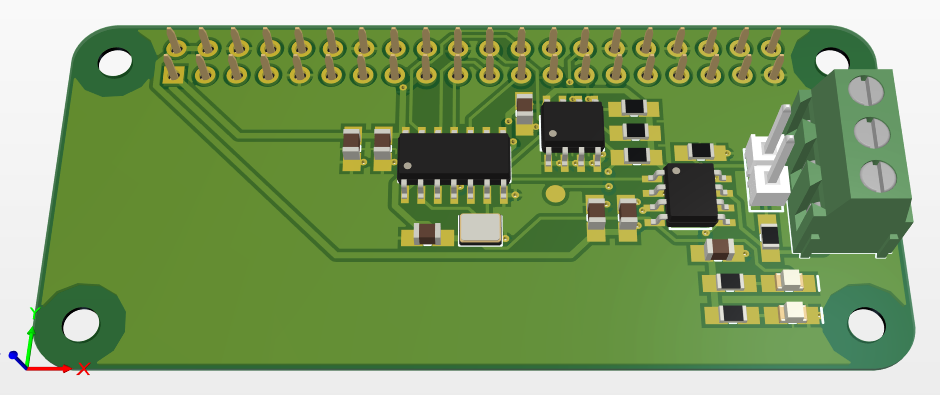
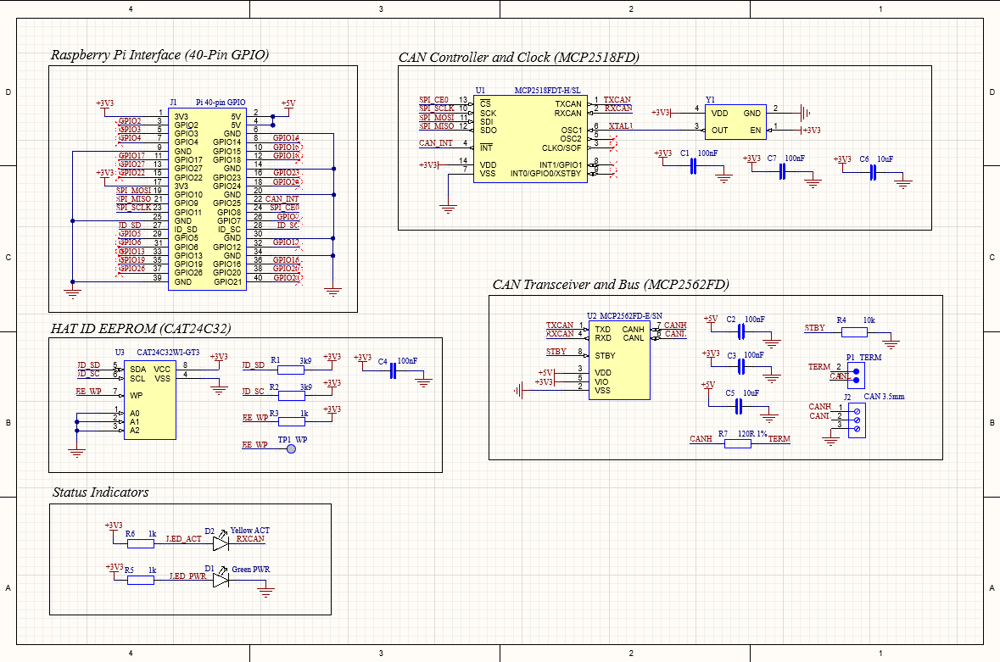
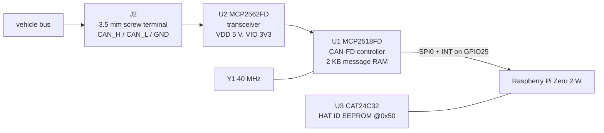

# CAN-FD Sniffer pHAT for the Raspberry Pi Zero 2 W

A 65 x 30 mm two-layer HAT that gives a Pi Zero 2 W one CAN-FD channel, so it can sit on a
vehicle bus and log or transmit frames. Think of it as a Waveshare CAN HAT that also speaks
CAN-FD, except that every symbol, every footprint and every design rule in it was drawn
from the datasheets rather than pulled from a vendor library.

The board is a bench and workshop tool. It is not an in-vehicle ECU, and the differences
that follow from that are spelled out under [known limitations](#known-limitations).

**Status:** schematic and layout complete, DRC clean with zero violations. The board has
not been fabricated yet, so nothing here has been proven against real copper.



*Top side in Altium's 3D view. The 40-pin socket (J1) is mounted on the underside, which is
where a HAT's socket goes; only its solder tails show through here. The bottom layer is a
near-solid GND plane, and the pours stop short of the 6.2 mm bare land round each mounting
hole, as the HAT mechanical spec asks.*



*The single schematic sheet: Pi header, CAN controller and clock, transceiver and bus, HAT
ID EEPROM, status LEDs.*

---

## Signal chain



The transceiver turns the differential bus into single-ended TXD/RXD. The controller does
the CAN-FD protocol work and buffers frames in its own RAM. The interrupt line is what
makes this a sniffer instead of a polling toy: every received frame raises INT, and Linux
reads the frame out when it does.

On the Pi side there is no driver to write. The mainline `mcp251xfd` driver already
supports this controller, so the board comes up with one line in `/boot/config.txt`:

```
dtoverlay=mcp251xfd,spi0-0,interrupt=25,oscillator=40000000
```

The pin allocation was chosen to make that line work unmodified.

## Key parts

| Ref | Part | Why it is this part |
|---|---|---|
| U1 | MCP2518FD | Stand-alone CAN-FD controller on SPI, runs natively at 3.3 V, and the mainline Linux driver already supports it. No firmware needed, which matters because firmware is out of scope. |
| U2 | MCP2562FD | The variant **with the VIO pin**. VDD at 5 V drives the bus at full amplitude, while VIO at 3V3 sets the logic level of TXD, RXD and STBY. That keeps 5 V logic away from Pi GPIO in silicon rather than with discrete level shifters. |
| Y1 | 40 MHz crystal | What the `mcp251xfd` overlay expects, and the frequency the controller datasheet recommends for CAN-FD. A packaged oscillator would add roughly 10 mA to the 3V3 rail for no gain here. |
| U3 | CAT24C32 | The HAT ID EEPROM the Raspberry Pi HAT design guide names by example: 32 kbit, 16-bit addressing, strapped to 0x50. |
| J2 | 3.5 mm screw terminal, pluggable | The harness can stay wired while the board comes off the Pi. |
| R7 + JP1 | 120 R and a shunt | Bus termination that switches by moving a jumper, so no soldering iron is needed to take the board off the end of a bus. |

## Design decisions worth explaining

**5 V transceiver with 3.3 V logic.** The one requirement that destroys hardware if it is
wrong is "no 5 V shall reach any Pi GPIO". Rather than trust a level shifter, the VIO pin
on the MCP2562FD sets the logic side of the transceiver to 3.3 V by construction. The bus
side still swings at 5 V, where the noise margin is worth having.

**No galvanic isolation.** Isolation costs a digital isolator plus an isolated DC-DC,
roughly 8 to 12 EUR and well over the 150 mA the Pi header is allowed to give up. For a
bench tool that shares a ground with the vehicle anyway, it buys nothing. This is a
deliberate trade, and it is the first thing that would change if the board ever went into
a vehicle permanently.

**No on-board 3.3 V regulator.** Logic power comes from the Pi's own 3V3 pins. Worst case
the board pulls 25.2 mA off that rail, which the Pi's regulator has ample headroom for.
An LDO would make the board independent of the Pi, at the cost of a part it does not need.

**Activity LED driven from RXD, not from software.** D2 hangs off the transceiver's RXD
pin, so it flickers on real bus traffic with no firmware involved. The RXD pin is
specified for 4 mA at VOL, and the LED draws about 1.4 mA, so it is well inside what the
pin can sink.

**J1 on the underside.** The first layout had the header footprint mirrored: pin 1 sat at
the far end of the row, which would have put the Pi's 3V3 (pin 1) on this board's GND
(pin 39). Moving J1 to the bottom side fixes it, and is also where a HAT's female socket
physically belongs. Checked pad by pad against the Pi Zero 2 W mechanical drawing.

**Mounting holes locked before routing.** An unnetted through-hole pad looks like a free
via to an autorouter. On the first routing pass the router used mounting hole MH2 to
change layers, which on an assembled HAT shorts that net to an M2.5 screw and the Pi's
mechanical ground. The holes are now locked and unnetted, and their nets are checked after
every route. Details are in [the layout document](docs/04-layout.md).

**Everything drawn from datasheets.** 12 schematic symbols and 10 footprints, no external
library dependency. Every land pattern traces to a source: Microchip drawing C04-2065-SL
for the SOICs, IPC-7351 hand-solder variants for the 0805s, and the official Raspberry Pi
mechanical drawings for the outline and hole positions.

## Power budget

All figures are datasheet maximums over temperature, not typicals, because the budget has
to survive the worst part rather than the average one.

```
5 V rail
  U2 MCP2562FD, continuous dominant      =  70.0 mA
                                            -------
  worst case                             =  70.0 mA   (limit 150 mA)

3V3 rail
  U1 MCP2518FD, 40 MHz + 20 MHz SPI      =  20.0 mA
  U2 VIO, continuous dominant            =   0.5 mA
  U3 CAT24C32, during write              =   2.0 mA
  D1 power LED                           =   1.4 mA
  D2 activity LED                        =   1.3 mA
                                            -------
  worst case                             =  25.2 mA

Total from the Pi header, worst case     =  95.2 mA  (~0.43 W)
```

"Continuous dominant" is the transmit-stuck fault case. Sniffing passively, with TXD held
recessive, the 5 V rail sees about 10 mA and the whole board idles under 30 mA.

## What state the design is in

| Item | State |
|---|---|
| Schematic | 24 components, every pin connected or explicitly marked No-ERC |
| Symbol library | 12 symbols, all drawn for this project |
| Footprint library | 10 footprints, all drawn for this project |
| Layout | 2 layers, 65.0 x 30.0 mm, fully routed (rev 2, placed along the signal flow) |
| Design rules | Clearance 6 mil (0.3 mm for pours), width 6 mil min with 0.5 mm power and 0.3 mm CAN classes, via 0.3/0.6 mm, drill 0.3 to 3.0 mm, annular ring 0.15 mm |
| DRC | **0 violations, 0 waivers**, report in `hardware/Project Outputs for CAN_Sniffer_HAT/` |
| 3D | STEP model on every part |
| Gerbers, BOM, assembly drawing | not generated yet |
| Fabricated and tested | no |

## Requirement traceability

The full specification is [`docs/01-requirements.md`](docs/01-requirements.md). Every ID in
it is tracked here.

| ID | Requirement, in short | State | Evidence |
|---|---|---|---|
| FR-01 | One CAN-FD channel over SPI | Pass | U1 on SPI0 CE0 |
| FR-02 | CAN-FD, 1 Mbit/s arbitration, 5 Mbit/s data | Pass | MCP2518FD to 8 Mbit/s, MCP2562FD rated 2/5/8 Mbit/s, 40 MHz clock |
| FR-03 | CAN_H, CAN_L, GND on a removable terminal, 3.5 mm | Pass | J2, pluggable, 3.5 mm pitch |
| FR-04 | 120 R termination, selectable without soldering | Pass | R7 in series with the P1 shunt to CANL. P1 pin 1 was unconnected until layout rev 2, so the jumper did nothing; see [the layout document](docs/04-layout.md#9-rev-2-of-the-layout) |
| FR-05 | Two status LEDs | Pass | D1 power, D2 on transceiver RXD |
| FR-06 | HAT ID EEPROM at 0x50 on ID_SD/ID_SC | Pass | U3, A0 to A2 grounded, 3k9 pull-ups, WP test point |
| FR-07 | Interrupt to an edge-capable GPIO | Pass | U1 INT to GPIO25 |
| FR-08 | Unused GPIO on a breakout header | Open | J3 (2x12) is in the Gate 2 netlist but is no longer on the schematic or the board |
| ER-01 | Powered only from the Pi header | Pass | No other connector carries power |
| ER-02 | Under 150 mA from the 5 V rail | Pass | 70 mA worst case, calculated above |
| ER-03 | 3.3 V logic only, no 5 V at any GPIO | Pass | U2 VIO on 3V3, U1 native 3.3 V, no 5 V net touches a GPIO net |
| ER-04 | Decoupling within 5 mm of every supply pin | Pass | Measured pad to pad: 4.5, 2.6, 2.7 and 2.7 mm |
| ER-05 | Bus survives a short to 12 V | Pass | Transceiver bus pins rated -58 to +58 V |
| ER-06 | Oscillator inside the controller's tolerance | Pass | 40 MHz +/-30 ppm against a +/-0.5 % requirement |
| MR-01 | 65.0 x 30.0 mm outline | Pass | Vertices read back from the saved `.PcbDoc` |
| MR-02 | Four M2.5 holes per the Raspberry Pi drawing | Pass | 58 x 23 mm pitch, 2.75 mm drill, unplated, no land |
| MR-03 | Header seats on a Zero 2 W without interference | Pass | Socket on the underside, pin 1 at (8.37, 25.23) mm over the Pi's pin 1 per the Zero 2 W drawing; checked in 3D |
| MR-04 | Terminal reachable with the board mounted | Pass | J2 on the board edge, wire entry facing out; checked in 3D |
| MR-05 | Nothing taller than an 11 mm spacer, except header and terminal | Pass | Everything else is SOIC or 0805, under 2 mm |
| MFR-01 | 2 layers, 1.6 mm FR-4, 1 oz copper | Open | Layer stack not yet set |
| MFR-02 | 6 mil track and clearance, enforced by rules | Pass | Rules configured, DRC clean |
| MFR-03 | 0.3 mm minimum drill, 0.15 mm annular ring | Pass | Rules configured, DRC clean |
| MFR-04 | Every part orderable, supplier and stock recorded | Open | Needs the BOM |
| MFR-05 | Passives 0805 or larger | Pass | All passives are 0805 |
| MFR-06 | Silkscreen carries designators, pin 1, name, revision, designer | Open | Needs a silkscreen pass |

## Known limitations

- **Never built.** The design is DRC clean on screen. No copper exists, so nothing here
  has been measured on a real bus.
- **No galvanic isolation.** The Pi has to share a ground with the vehicle. A ground
  offset between the two shows up directly on the transceiver's bus pins.
- **The crystal footprint is generic.** `XTAL_3225_4P` is a standard 3.2 x 2.5 mm 4-pad
  land. It must be checked against the crystal actually ordered before the board is sent
  out.
- **Termination is a plain 120 R**, not split termination with a capacitor to the SPLIT
  pin. Split termination behaves better for EMC and is the obvious change for a rev B.
- **The CAN pair needs one crossing.** J2's pin order (CAN_H below CAN_L) is the reverse
  of the transceiver's, so the pair cannot be routed flat on one layer. It is under 10 mm
  long, so this is cosmetic at these data rates.
- **No EMC work, no enclosure, no firmware.** All three are outside the scope of this
  project.

## Repository layout

```
01-CAN-Sniffer-HAT/
  docs/
    01-requirements.md     the specification the design was built against
    02-architecture.md     part selection, power budget, pin allocation, open questions
    03-schematic.md        netlist, symbol library, checks that passed
    04-layout.md           placement, routing, design rules, DRC, the defects found
    datasheets/            every datasheet and drawing cited above
  hardware/                the Altium project: schematic, PCB, both libraries, DRC report
  tools/                   the generators the libraries and the sheet are built from
```

## How the schematic was built

The symbol library, the footprint library and the schematic sheet are generated from text
sources rather than drawn by hand, which keeps the netlist reviewable as a diff and lets a
script check it. `tools/gen_wire.py` asserts that all 138 pins belong to exactly one net
and that no net has fewer than two pins, so a broken netlist fails before Altium is
opened. The rev 2 placement is a table in `tools/router/place.py`, which checks pad
clearances before anything moves, and the tracks come from `tools/router/route.py`, an
octilinear maze router written for this board in place of the Altium autorouter.

[`tools/README.md`](tools/README.md) documents the scripts and the Altium behaviour worth
knowing before doing this to yourself.

## Design documents

| Document | Covers |
|---|---|
| [Requirements](docs/01-requirements.md) | What the board has to do, and how each requirement gets verified |
| [Architecture](docs/02-architecture.md) | Part selection with reasons, block diagram, power budget, pin allocation, cost |
| [Schematic](docs/03-schematic.md) | Full netlist, symbol library, the checks that were run against the saved file |
| [Layout](docs/04-layout.md) | Placement, routing, design rules, DRC, and every defect that was found and fixed |

---

Designed by Muhamad Izzuwan Alif. Altium Designer 26, two-layer FR-4.
