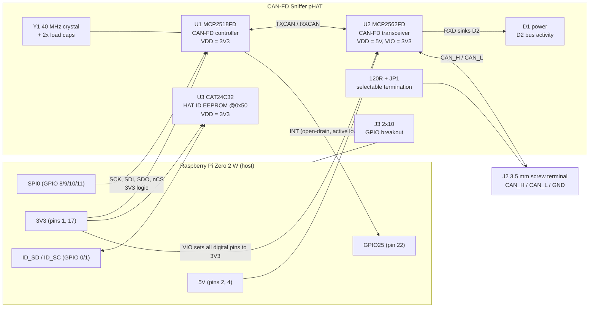

# CAN-FD Sniffer pHAT - Gate 1: Architecture

| | |
|---|---|
| **Document** | ARCH-001 |
| **Revision** | A |
| **Date** | 2026-08-26 |
| **Designer** | Muhamad Izzuwan Alif |
| **Against** | REQ-001 Rev A |
| **Status** | Submitted for Gate 1 review |

Deliverables for this gate per REQ-001 §8: part selection justified, block diagram,
power budget. Layout and schematic capture do not start until this is signed off.

---

## 1. Block diagram



**Signal flow in one line:** vehicle bus → screw terminal → MCP2562FD (differential →
single-ended, 5 V side) → MCP2518FD (CAN-FD protocol engine + 2 KB message RAM,
3.3 V side) → SPI → Pi. The interrupt line is what makes it a *sniffer* rather than a
polling toy: every received frame raises INT and Linux reads it out.

---

## 2. Part selection and justification

| Ref | Part | Package | Why this part | Requirement served |
|---|---|---|---|---|
| **U1** | Microchip **MCP2518FDT-H/SL** | SOIC-14 | Stand-alone CAN-FD controller on SPI. Data rate to **8 Mbit/s**, SPI to **20 MHz**, VDD **2.7-5.5 V** so it runs natively at 3.3 V with no level shifting. Supported out of the box by the mainline Linux `mcp251xfd` driver, so no firmware work is needed, and firmware is out of scope (§1). | FR-01, FR-02, ER-03 |
| **U2** | Microchip **MCP2562FD-E/SN** | SOIC-8 | The variant **with the VIO pin**. VDD 4.5-5.5 V drives the bus at full amplitude while VIO 1.8-5.5 V sets the logic level of TXD/RXD/STBY independently. Tie VIO to 3V3 and **no 5 V logic can ever appear on a Pi GPIO**. That is the mitigation for the destroy-the-Pi requirement, done in silicon rather than with discrete level shifters. Rated for CAN-FD at 2/5/8 Mbit/s. Bus pins absolute-max **-58 V to +58 V**. | FR-01, FR-02, ER-03, ER-05 |
| **Y1** | 40.000 MHz crystal, ±30 ppm, CL 18 pF, 3225 SMD | 4-pad 3.2×2.5 | MCP2518FD accepts 4 / 20 / 40 MHz; the CAN-FD community recommendation printed in the datasheet is 40 or 20 MHz SYSCLK, and 40 MHz is what the `mcp251xfd` overlay expects. Crystal chosen over a packaged oscillator because an XO adds ~10 mA to the 3V3 rail for no benefit here. | FR-02, ER-06 |
| **C_L1, C_L2** | 2 × load caps, value set from crystal CL and stray | 0805 | Sized once Y1 is ordered: `C_L = 2·(CL - C_stray)`, C_stray ≈ 5 pF for this stack-up. | ER-06 |
| **U3** | onsemi **CAT24C32WI-GT3** | SOIC-8 | The part the Raspberry Pi HAT design guide names by example. 32 kbit, **16-bit addressing** (the guide forbids 8-bit devices), non-paged, 3.3 V, hardware write protect over the whole array. Strapped to address **0x50**. | FR-06 |
| **J1** | 2×20 female header, 2.54 mm, through-hole | 8.5 mm body | "Full 40W GPIO connector" is a hard minimum HAT requirement. Through-hole for hand assembly. | FR-08, MR-03, HAT spec |
| **J2** | 3-position screw terminal, **3.5 mm** pitch, removable (plug + header) | THT | FR-03 asks for removable and ≥3.5 mm. A pluggable two-piece terminal also lets the harness stay wired while the board comes off the Pi. | FR-03, MR-04 |
| **J3** | 2×10 male header, 2.54 mm | THT | Passes the 20 GPIO the design does not consume out to a breadboard-friendly strip. | FR-08 |
| **R_T** | 120 Ω ±1 %, 0.25 W | 0805 | Bus termination. In series with JP1 so it is switched by moving a shunt. **No soldering**, which is what FR-04 actually demands. | FR-04 |
| **JP1** | 2-pin header + shunt | THT | Termination select. Silkscreened `TERM ON/OFF`. | FR-04 |
| **D1** | Green LED + 1 kΩ | 0805 | Power-good indicator on 3V3. ~1.4 mA, bright enough in a workshop and cheap on the budget. | FR-05 |
| **D2** | Yellow LED + 1 kΩ, driven from **U2 RXD** | 0805 | Lights on every dominant bit, i.e. real bus traffic, with no firmware. RXD is specified VOL ≤ 0.4 V at **IOL = 4 mA** (typ 8 mA), so a ~1.4 mA LED is well inside its drive capability. | FR-05 |
| **C1..C4** | 100 nF X7R | 0805 | One per IC supply pin (U1 VDD, U2 VDD, U2 VIO, U3 VDD), each placed within 5 mm at layout. | ER-04 |
| **C5, C6** | 10 µF X7R | 0805 | Bulk on the 5 V and 3V3 rails at the point of entry from J1. | ER-04 |
| **R1, R2** | 3.9 kΩ | 0805 | ID_SD / ID_SC pull-ups to 3V3, the value the HAT design guide specifies. | FR-06 |
| **R3** | 1 kΩ | 0805 | EEPROM WP pull-up to 3V3, with a test point and a solder jumper to GND for reflashing, exactly as the design guide's fragment shows. | FR-06 |
| **R4** | 10 kΩ | 0805 | U2 STBY pulled low → transceiver permanently in Normal mode. Deliberate: a sniffer must never be asleep. | FR-01 |

**Nothing is on this list without a datasheet in `docs/datasheets/` (C-03).**
U1, U2, U3, the HAT mechanical drawing and the Pi Zero 2 W mechanical drawing are already
committed there. Y1 and the connectors get theirs when the exact MPNs are locked at
BOM time.

### Parts deliberately *not* used

- **Galvanic isolation** (as on the Waveshare 2-CH HAT). Costs a digital isolator plus an
  isolated DC-DC, roughly 8-12 € and well over the 150 mA budget of ER-02. The spec calls
  for a bench/workshop tool (§1), not an in-vehicle ECU. **Limitation to state in the
  README:** ground offsets between vehicle and Pi are not tolerated; the Pi must share the
  vehicle ground.
- **A 3.3 V LDO.** See open question Q-2.
- **Split termination** (2 × 60.4 Ω + cap to U2's SPLIT pin). Better EMC, but FR-04 asks for
  a 120 Ω resistor. Noted as a Rev B option.
- **TVS on CAN_H / CAN_L.** The transceiver's own ±58 V rating already covers ER-05
  (short to 12 V, and to 24 V). A TVS would be for surge, which is out of scope (no EMC).

---

## 3. Pi pin allocation

Chosen so the board runs on the stock Linux `mcp251xfd` driver with one config line and
no custom device tree:
`dtoverlay=mcp251xfd,spi0-0,interrupt=25,oscillator=40000000`

| Pi pin | GPIO | Function | Goes to |
|---|---|---|---|
| 1, 17 | - | 3V3 | U1, U3, U2 VIO, LEDs |
| 2, 4 | - | 5V | U2 VDD |
| 6, 9, 14, 20, 25, 30, 34, 39 | - | GND | plane |
| 19 | GPIO10 | SPI0 MOSI | U1 SDI |
| 21 | GPIO9 | SPI0 MISO | U1 SDO |
| 23 | GPIO11 | SPI0 SCLK | U1 SCK |
| 24 | GPIO8 | SPI0 CE0 | U1 nCS |
| 22 | GPIO25 | interrupt | U1 INT (active low, open-drain configurable) |
| 27 | ID_SD | HAT ID I²C data | U3 SDA + R1 |
| 28 | ID_SC | HAT ID I²C clock | U3 SCL + R2 |
| all others (20 pins) | - | untouched | J3 breakout |

GPIO7 / CE1 is left free at J3 so a second controller could be stacked later without a
board change.

---

## 4. Power budget (ER-02)

All figures are datasheet **maximum** over temperature, not typical. The budget has to
survive the worst part, not the average one.

### 5 V rail (from J1 pins 2/4)

```
U2 MCP2562FD VDD, continuous dominant   =  70.0 mA   (max; typ 45)
                                          -------
Total 5V worst case                     =  70.0 mA
ER-02 limit                             = 150.0 mA
Margin                                  =  80.0 mA   (53 % headroom)
```

"Continuous dominant" is the transmit-stuck fault case. In the intended use, passive
sniffing with TXD held recessive, U2 draws 10 mA max and the 5 V rail sees `10 mA`.

### 3.3 V rail (from J1 pins 1/17)

```
U1 MCP2518FD, 40 MHz SYSCLK + 20 MHz SPI =  20.0 mA   (max; typ 15)
U2 VIO, continuous dominant              =   0.5 mA   (max; typ 0.085)
U3 CAT24C32, ICCW during write           =   2.0 mA   (max, fSCL = 400 kHz)
D1 power LED, (3.3 - 1.9)/1k             =   1.4 mA
D2 activity LED, (3.3 - 2.0)/1k          =   1.3 mA
                                           -------
Total 3V3 worst case                     =  25.2 mA
```

Idle/typical is ~18 mA, since the EEPROM is read once at boot and then drops to its
standby current of a few µA.

**Total drawn from the Pi, worst case: 70 + 25.2 = 95.2 mA**, i.e. ~0.43 W. Well inside
ER-02 for the 5 V rail, and see Q-2 for the 3.3 V rail.

---

## 5. Mechanical baseline (MR-01, MR-02)

Sources, as MR-02 requires them to be cited. Both PDFs are in `docs/datasheets/`:

- *Raspberry Pi HAT Board Mechanical Specification*, Raspberry Pi 2014/2018,
    `RPi-HAT-board-mechanical.pdf`, from <https://github.com/raspberrypi/hats>
- *Raspberry Pi Zero 2 W mechanical drawing*, RP-008358-DS-1, `RPi-Zero-2W-mechanical.pdf`

| Item | Value | Source |
|---|---|---|
| Board outline | 65.0 × 30.0 mm | Zero 2 W drawing (65 x 30), matches MR-01 |
| Corner radius | 3.0 mm | HAT drawing, "3 mm radius corners" |
| Mounting holes | 4 × M2.5, **drill 2.75 mm ±0.05** | HAT drawing, mounting hole spec |
| Hole centres | (3.5, 3.5) (61.5, 3.5) (3.5, 26.5) (61.5, 26.5) | 3.5 mm inset per both drawings; 58 mm × 23 mm pitch |
| Hole land | ≥ 6.2 mm, **isolated from GND** | HAT drawing: "do not connect these to GND" |
| Header | full 40 W, 2×20 | HAT drawing, minimum requirements |

Under-spacer height (MR-05, 11 mm): the tallest parts are J1 (8.5 mm body) and J2
(~10 mm), both explicitly exempted by MR-05. Everything else is SOIC or 0805, under
2 mm. Compliant by construction.

---

## 6. Two-layer routability (C-02)

The board carries **7 fast nets** (4 SPI + INT + TXCAN/RXCAN, all short and local) and
2 differential bus nets from U2 to J2. Everything else is power, ground, or a
straight pass-through from J1 to J3. Plan: **top layer = signals, bottom layer = solid
ground pour**, with the CAN pair routed as a short parallel pair on top, over unbroken
ground. No crossing of the SPI bus is required if U1 sits directly under the header run.
**Two layers is sufficient; no four-layer request.**

---

## 7. Cost check (C-01, budget 50 €)

Indicative single-unit prices, to be replaced by real supplier + stock figures at BOM
time per MFR-04:

```
MCP2518FDT-H/SL                ~ 1.85
MCP2562FD-E/SN                 ~ 1.20
CAT24C32WI-GT3                 ~ 0.35
40 MHz crystal                 ~ 0.50
2x20 female header             ~ 1.50
3.5 mm screw terminal (3 pos)  ~ 1.00
2x10 male header + JP1         ~ 0.70
Passives, LEDs (18 parts)      ~ 1.50
                                 -----
BOM subtotal                   ~ 8.60 EUR
PCB, 5 pcs 65x30 2-layer       ~ 8-12 EUR incl. shipping
                                 -----
One prototype build            ~ 17-21 EUR
```

Comfortably inside C-01, with room for the Rev B split-termination option.

---

## 8. Requirement traceability at architecture level

Gate 2 and Gate 3 fill in the evidence column; this is the seed of D-10.

| ID | Addressed by | Status |
|---|---|---|
| FR-01 | U1 on SPI0 CE0 | Architected |
| FR-02 | U1 8 Mbit/s + U2 rated 2/5/8 Mbit/s + 40 MHz clock | Architected |
| FR-03 | J2, 3.5 mm removable, 3 pos | Architected |
| FR-04 | R_T 120 Ω in series with JP1 shunt | Architected |
| FR-05 | D1 power, D2 on U2 RXD | Architected |
| FR-06 | U3 CAT24C32 @0x50, R1/R2 3.9 k, R3 WP | Architected |
| FR-07 | U1 INT → GPIO25, edge-capable | Architected |
| FR-08 | J3 2×10 | Architected |
| ER-01 | No connector other than J1 carries power | Architected |
| ER-02 | 70 mA worst case on 5 V vs 150 mA limit (§4) | **Calculated, passes** |
| ER-03 | U2 VIO = 3V3; U1 native 3.3 V; no 5 V net touches a GPIO net | **Architected, re-check at Gate 2** |
| ER-04 | C1-C4 one per IC, ≤5 mm at layout | Deferred to layout |
| ER-05 | U2 bus pins abs-max ±58 V ≫ 12 V | **Datasheet-verified** |
| ER-06 | Datasheet needs 40 MHz ±0.5 %; Y1 is ±30 ppm ⇒ ~166× margin | **Datasheet-verified** |
| MR-01 | 65.0 × 30.0 mm | Architected |
| MR-02 | Hole positions from cited drawings (§5) | **Source cited** |
| MR-03 | Full 2×20 header, HAT-spec position | Deferred to layout |
| MR-04 | J2 on the outer long edge | Deferred to layout |
| MR-05 | Only J1/J2 exceed 11 mm class; both exempt | Architected |
| MFR-01..06 | Deferred to rules setup and BOM | Deferred |

---

## 9. Open questions, and the decision taken on each

Five points in REQ-001 are open to reading. Each is written down here with the choice
made and the reason, so the choice is on record rather than buried in the schematic.

**Q-1. FR-02 against ER-05, transceiver operating voltage.** ER-03 forbids 5 V at any Pi
GPIO; it does *not* forbid 5 V on the board. A 3.3 V-only transceiver such as the
TCAN1462 would take 5 V off the board entirely, at the cost of bus drive.
**Decision: MCP2562FD at VDD = 5 V with VIO on 3V3.** A 5 V-driven bus has the better
noise margin, and the VIO pin gives ER-03 a guarantee in silicon that a discrete level
shifter does not.

**Q-2. The 3.3 V rail is unbudgeted.** ER-02 caps the **5 V** draw at 150 mA and the spec
is silent on 3.3 V; the official HAT design guide is silent too. I have kept the 3V3 draw
to **26.2 mA worst case** by taking logic power from the Pi's 3V3 pins. The alternative is
a 5 V→3.3 V LDO on-board, which makes the design independent of the Pi's 3V3 regulator and
brings the total 5 V draw to ~96 mA, still inside ER-02, at the cost of one more part.
**Decision: no LDO.** The Pi's own regulator has ample headroom for 26 mA, and the extra
part buys an independence this board does not need.

**Q-3. FR-08, how many GPIO must break out.** All 20 unused pins do not fit as a 2x20 on
a 65 x 30 board alongside J1 and J2. The plan at architecture time was a 2x10 carrying
every GPIO the design does not consume. **Resolved during schematic capture: J3 became a
2x12 and carries all 21 unused GPIO**, so nothing is dropped.

**Q-4. FR-07, which GPIO for INT.** The mainline `mcp251xfd` overlay takes the interrupt
pin as a parameter (`interrupt=<gpio>`) with no built-in default, so any free GPIO works.
**Decision: GPIO25**, because it is the pin the common Pi CAN boards use, so existing
tutorials and config lines apply unchanged. Nothing else on the board wants it.

**Q-5. MFR-04, "stock figure recorded at design time".** Distributor stock moves daily.
**Decision: capture supplier, supplier PN, price and stock once, at Gate 3**, with the
date stamped in the BOM. Recording it at Gate 1 only means recording it twice.
