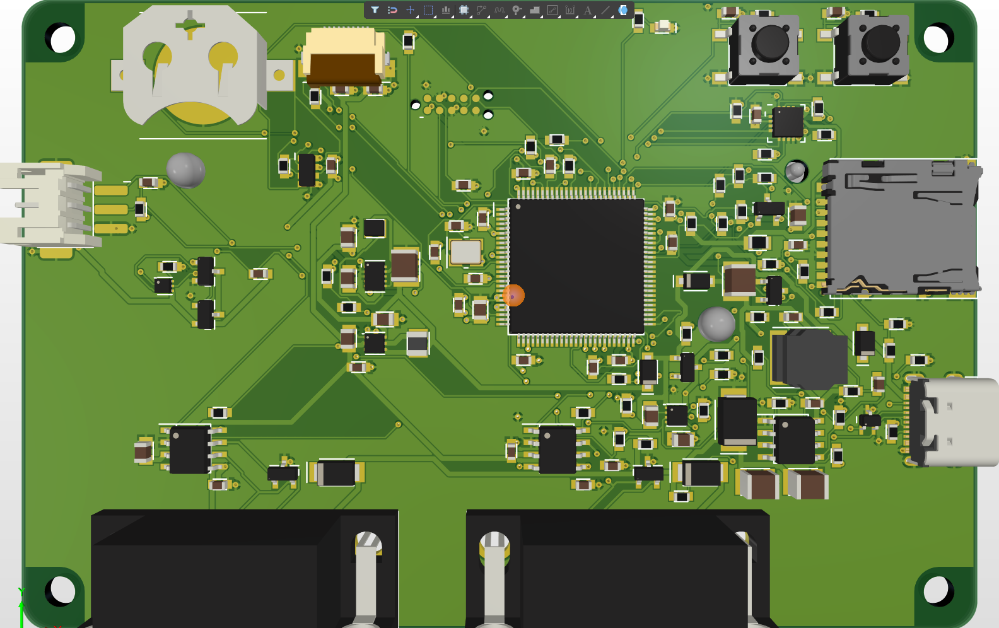
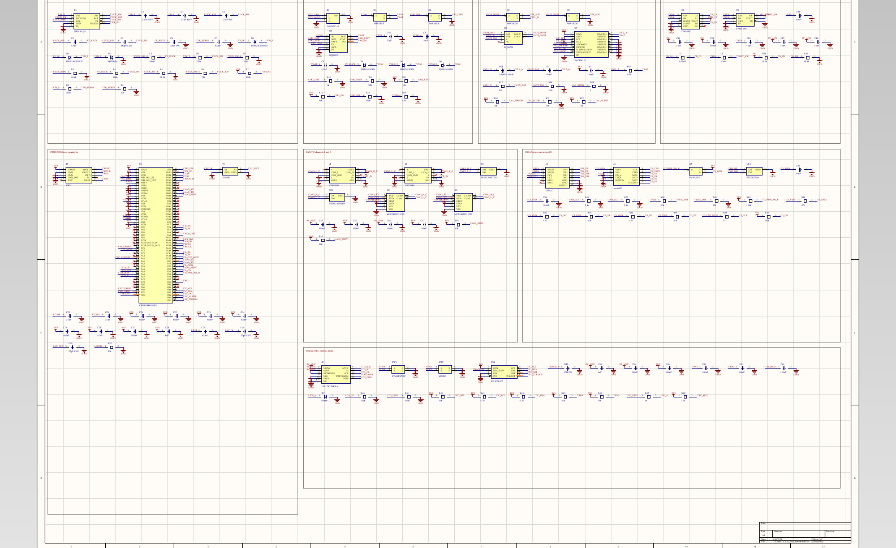

# CAN-FD Test Runner

A handheld device that connects to a car's OBD-II port, runs a **test you wrote beforehand**
for the length of a drive, and ends with a verdict: **PASSED**, **FAILED**, or
**INCOMPLETE**. Two CAN-FD channels on DB9 connectors, its own battery so the test survives
key-off, and a USB port so the logs come off without touching the card.

> **Note on method.** The requirements and architecture for this board were developed in
> discussion with an AI assistant. Every figure in them is either derived in the document
> itself or taken from a cited datasheet, and the design decisions are mine.

**Status:** schematic captured and board laid out: four layers, 100 x 66 mm, routed, **DRC
clean with 0 violations**. Fabrication package and firmware not started.



---

## The problem it solves

Every CAN logger on the market records blindly. You drive, you come home, you open the log,
and only then do you discover that a diagnostic request went unanswered, the timestamps have
a hole in them, or the logger reset halfway. By that point the vehicle is gone and the
conditions may not come back for weeks.

The vendors know this. CSS Electronics' own getting-started guide tells you to check your
data quality by pulling the SD card and opening the file in asammdf, at your desk, afterwards.

This device does that check **while it is still recording**, and tells you in the car.

## How a test is defined

One rule per line, in a text file on the SD card:

```
name     idbuzz-hv-drive
channel  1  500k  2M
channel  2  listen-only

poll     1  22 F1 90    every 1000 ms   answer within 100 ms
decode   pack_voltage   from 22 1E 3B   bytes 4:6   scale 0.25   unit V
range    pack_voltage   280 to 460
require  pack_current   present for the whole session
quiet    2              from 22:00 to 06:00
verdict  fail on        3 consecutive missed answers
```

The device transmits what the test asks for, watches what comes back, and grades the session
against those rules. A broken rule is flagged on the display the moment it breaks, not at the
end.

## Why it runs on its own battery

The device charges from the vehicle and carries a LiFePO4 cell, so a test **does not end when
the ignition does**. It keeps watching after key-off, through the ECU sleep sequence and
overnight.

That turns out to be the most useful mode. A car that goes flat overnight is a common
complaint and a hard one to diagnose. This device logs **which ECU woke the bus, and at what
time**, which is exactly what a clamp meter across the battery cannot tell you.

## Design highlights so far

**The SD card chose the microcontroller.** A microSD card can stall for up to 250 ms doing
its own housekeeping, and frames keep arriving while it does. At the worst-case data rate
that is 120 KB piling up in RAM, so the buffer needs about 256 KB. That single number
eliminated otherwise suitable parts and picked the STM32H563 with its 640 KB of SRAM. Working
in [the architecture document](docs/02-architecture.md), section 5.

**Charge inhibit is hardware, not firmware.** The device gets left in a car that reaches
60 to 70 C in summer, and lithium cells must not be charged hot. The charger reads a
thermistor against the cell and refuses on its own, with no software involved, so a crashed
program cannot leave a cell charging at 65 C.

**Two pin collisions found before any board existed.** The card's data line 0 and CAN channel
2's transmit pin share two of their three possible pins, and SPI3 is wiped out entirely by
the card in 4-bit mode. Both were found in STM32CubeMX at Gate 1 rather than at Gate 3.
Details in section 8 of the architecture document.

## Gates

| Gate | Covers | State |
|---|---|---|
| 1. Architecture | parts, block diagram, power budget, cell chemistry, pin check | **complete** |
| 1.5. Mechanical integration | enclosure, 3D models, board outline and keep-outs | outline and 3D models done, enclosure open |
| 2. Schematic | full schematic, ERC clean, traceability | **captured**, ERC report to commit |
| 3. Layout and release | DRC, manufacturing package | **layout done, DRC clean**; fab package outstanding |
| 4. Firmware and proof | firmware, and one PASSED, one FAILED, one INCOMPLETE session | not started |

## Documents

| Document | Covers |
|---|---|
| [Requirements](docs/01-requirements.md) | What the device must do, and how each requirement gets verified |
| [Architecture](docs/02-architecture.md) | Parts with reasons, power architecture, cell chemistry, power budget, buffer arithmetic, pin allocation, test file format, open questions |
| [Schematic](docs/03-schematic.md) | Part changes against the architecture, design values from each datasheet, pin allocation, traceability |
| [Layout](docs/04-layout.md) | Stack-up, design rules with reasons, placement, routing, DRC report, 3D models, open items |



## Known limitations at this stage

- **Nothing is built.** Every figure is calculated or from a datasheet. None is measured.
- **Wake-up loses the first frame.** The transceiver's low-power receiver wakes the device on
  bus activity, but the frame that did the waking is not itself captured. The wake timestamp
  is recorded instead (Q-5).
- **No enclosure yet.** The 100 x 66 mm outline was fixed first; the mounting holes must be
  checked against an enclosure drawing once one is chosen (MR-05).

---

Designed by Muhamad Izzuwan Alif. Altium Designer 26, four-layer FR-4.
