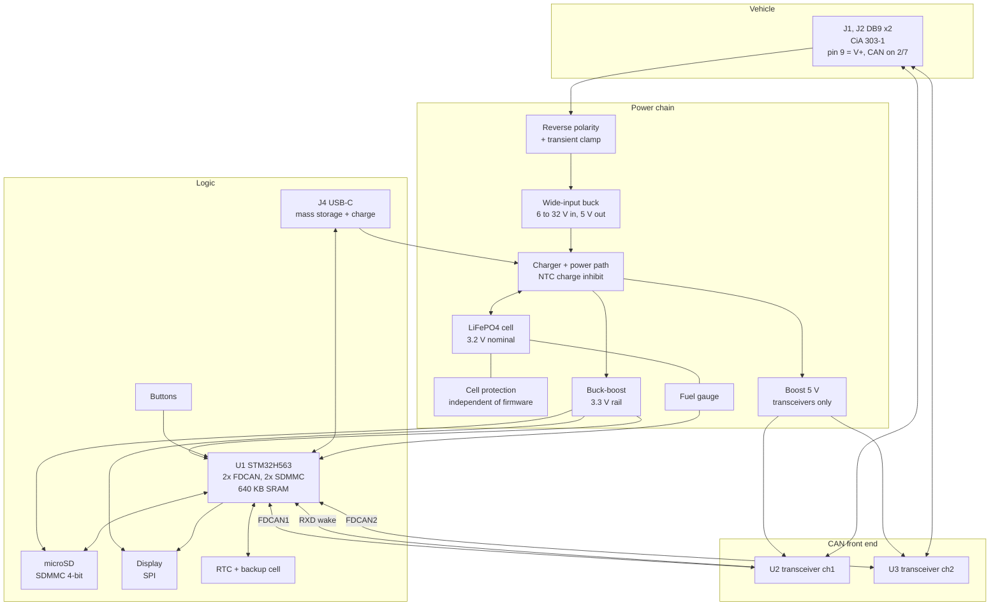

# CAN-FD Test Runner - Gate 1: Architecture

| | |
|---|---|
| **Document** | ARCH-002 |
| **Revision** | A |
| **Date** | 2026-08-30 |
| **Designer** | Muhamad Izzuwan Alif |
| **Against** | REQ-002 Rev A |
| **Status** | Submitted for Gate 1 review |

Deliverables for this gate per REQ-002 section 9: part selection justified, block diagram,
power budget, cell chemistry with the temperature argument, the ER-12 runtime budget, and a
sketch of the test file format. Mechanical work is Gate 1.5 and schematic capture is Gate 2.
Neither starts until this is signed off.

---

> **Note on method.** The requirements and architecture for this board were developed in
> discussion with an AI assistant. Every figure in them is either derived in the document
> itself or taken from a cited datasheet, and the design decisions are mine.

## 1. Block diagram



**Signal flow in one line:** vehicle bus into two transceivers, into the two FDCAN
controllers inside the microcontroller, timestamped, buffered in SRAM, checked against the
test rules, and written to the SD card, with the verdict on the display. The power chain to
the left is what makes the device outlive the ignition.

---

## 2. Part selection and justification

| Ref | Part | Why this part | Requirement served |
|---|---|---|---|
| **U1** | ST **STM32H563VIT6**, LQFP-100 | Two independent FDCAN controllers and two SDMMC hosts on one die, so both channels and the card are native peripherals with DMA rather than bit-banged over SPI. **640 KB of SRAM** is the deciding number, and section 5 shows why. Cortex-M33 at 250 MHz, and a Nucleo-H563ZI board exists for the firmware-first work C-04 demands. | FR-01, FR-03, SR-02, SR-03, C-04 |
| **U2, U3** | Microchip **MCP2562FD-E/SN**, SOIC-8 | The transceiver from project 01, so the symbol, the footprint and the behaviour are already known and already verified against its datasheet. Standby current is **5 uA typical**, and in standby the low-power receiver and wake-up filter stay alive and pull RXD low on bus activity. That is exactly the wake path SR-09 needs. VIO on 3V3 keeps 5 V logic off the microcontroller. | FR-01, FR-17, SR-09, ER-07 |
| **BT1** | **LiFePO4 18650**, 3.2 V nominal, 1500 mAh class | Chemistry argument in section 4. | FR-15, ER-12 |
| **U4** | Wide-input buck, 6 to 32 V in, 5 V out | Turns a hostile vehicle rail into one clean 5 V rail. Every other converter then sees a friendly input, and the transient clamping problem is solved once, at the front. | ER-01, ER-02 |
| **U5** | LiFePO4 charger with power path and **NTC input** | The NTC input is what makes ER-10 a hardware property. The charger refuses to charge a hot or cold cell on its own, with no firmware involved, which is what C-06 requires. | FR-16, ER-09, ER-10, C-06 |
| **U6** | Cell protection IC plus FETs | Over-voltage, under-voltage, over-current and short circuit, independent of everything else on the board. | ER-11 |
| **U7** | Buck-boost to 3.3 V | A LiFePO4 cell runs from about 3.65 V down to 2.5 V, so 3.3 V sits inside the range. A plain buck browns out at the bottom of the discharge and a plain boost cannot start at the top. Buck-boost is the only correct answer here. | ER-06, FR-15 |
| **U8** | Boost to 5 V, transceivers only | The MCP2562FD needs 4.5 to 5.5 V on VDD. Chosen with a low quiescent current mode, because in watch mode it feeds two transceivers drawing 5 uA each and its own quiescent current then dominates. | ER-06 |
| **U9** | Fuel gauge | ER-13 wants remaining runtime predicted to 20 %. Cell voltage alone does not do that on LiFePO4, whose discharge curve is famously flat. A coulomb-counting gauge does. | FR-18, ER-13 |
| **U10** | Micro Crystal **RV-3028-C7** | An RTC module with **the crystal built in**, so it removes a part rather than adding one. Factory calibrated to **1 ppm at 25 C** against a 30 ppm requirement, and it runs on **45 nA**, which is under a thousandth of the watch-mode budget. FR-11 wants absolute time to survive on a backup cell for months, and at 45 nA it effectively does. | FR-11, ER-08 |
| **J1, J2** | 2 x DB9 male, CiA 303-1 pinout | One per channel, with V+ on pin 9. The vehicle-specific wiring moves into a cable, so the device is not tied to one connector standard and works on a bench too. | FR-02 |
| **J4** | USB-C receptacle, USB 2.0 full speed | Presents the SD card to a PC as a drive (FR-19) and charges the cell on a bench (FR-21). Full speed gives about 1 MB/s, which suits configuration and short sessions; bulk transfers still want the card reader. | FR-19, FR-21 |
| **J3** | microSD socket, push-push, card-detect | Card detect matters: SR-05 has to notice a card removed mid-session, and a switch is the only way to know. | FR-03, SR-05, MR-03 |
| **DS1** | Display, SPI | Trade-off open, see Q-3. | FR-07, FR-08, MR-02 |

**Nothing enters the BOM without a datasheet (C-03).** Three are now committed in
`docs/datasheets/`: **STM32H563** (ST DS14258, the combined H562/H563 datasheet),
**MCP2562FD**, and **RV-3028-C7**. The
power chain parts are named by function above. Section 12 gives a first choice for each with
the property that decided it, and every one still needs its datasheet in `docs/datasheets/`
before Gate 2.

### Why the H563 and not the cheaper H562

The STM32H562 and STM32H563 share one datasheet, and the published difference is usually
given as TrustZone and an Ethernet MAC, neither of which this design needs. That makes the
H562 look like the obvious saving.

It is not, and the peripheral count is what shows it. The pin definitions gave it away first,
since no H562 package has an FDCAN2 pin at all, and **ST's own datasheet confirms it**: the
feature comparison table in DS14258 lists FDCAN as **2 for every H563 part and 1 for every
H562 part**.

```
STM32H562, all packages   FDCAN1 only
STM32H563, all packages   FDCAN1 + FDCAN2
```

One CAN channel fails FR-01 outright, so the H562 is not a candidate at any price.
**TrustZone therefore comes along whether it is wanted or not.** That costs nothing: it is
enabled by an option byte, and left alone the part behaves as an ordinary microcontroller.
Confirm the shipped state of that option byte in the reference manual before the firmware
work starts, so a factory-fresh part is not a surprise.

### Parts deliberately not used

- **External SPI CAN controllers (MCP2518FD), as in project 01.** Reusing them would have
  saved design effort, but two channels of high-rate CAN-FD across one SPI bus adds latency
  and a bandwidth ceiling for no benefit, when the chosen microcontroller already has both
  controllers on-chip. The project 01 work is not wasted: the transceiver, its footprint and
  its behaviour carry straight over.
- **Galvanic isolation.** Argued in REQ-002 section 4. The device shares vehicle ground
  through its own power connector, so isolating the transceivers would isolate nothing.
- **Cellular or WiFi upload.** Out of scope, and the SD card is the deliverable interface.
- **A colour touchscreen.** Current cost during a 12 hour watch, and MR-02 asks for daylight
  readability, which backlit colour panels are bad at.

---

## 3. Power architecture

The power chain is the part of this design that project 01 did not have at all, so it gets
its own section.

```
OBD pin 16  -->  reverse polarity  -->  transient clamp  -->  wide-input buck  -->  5 V
                                                                                     |
                                                          +--------------------------+
                                                          |
                                                   charger + power path
                                                          |         \
                                                          |          \--> cell (LiFePO4)
                                                          |
                                                    system rail
                                                     /          \
                                          buck-boost 3.3 V    boost 5 V
                                                 |                 |
                                     MCU, SD, display        transceivers only
```

Three properties of this chain are deliberate:

**Power path, not a simple charger.** While the vehicle is connected, the system runs from
the vehicle and the cell charges in parallel. The device does not cycle its own cell every
time it is plugged in, and a flat cell does not prevent the device from working.

**The changeover is not a decision.** When vehicle power disappears the cell is already
carrying the rail through the same node. There is no switch to throw and no software to run,
which is what makes FR-15 achievable without losing a frame.

**Charge inhibit is in hardware.** The charger's NTC input reads a thermistor sitting against
the cell, not against the board. Outside the window the charger stops on its own. No
firmware, no I2C transaction, no possibility of a crashed program leaving a cell charging at
65 C. This is C-06 satisfied structurally rather than by discipline.

---

## 4. Cell chemistry (required by Gate 1)

| | Li-ion (NMC) | **LiFePO4** |
|---|---|---|
| Nominal voltage | 3.7 V | 3.2 V |
| Energy per 18650 cell | ~2500 mAh | ~1500 mAh |
| Charge temperature window | 0 to 45 C | 0 to 45 C |
| Discharge temperature window | -20 to 60 C | -20 to 60 C |
| Behaviour when abused | can go into thermal runaway | very reluctant to |
| Cycle life | 500 or so | several thousand |
| Discharge curve | sloped, easy to gauge | flat, needs coulomb counting |

**Decision: LiFePO4.**

Both chemistries have the same charge window, so the NTC inhibit of ER-10 is needed either
way. The argument is what happens when something goes wrong in a device whose whole purpose
is to be **left unattended in a parked car**. LiFePO4 is markedly more tolerant of heat and
abuse, and this device will spend summer afternoons in a vehicle that reaches 60 to 70 C
inside. The price is a third less energy per cell and a flat discharge curve, and the flat
curve is why U9 is a coulomb-counting gauge rather than a voltage divider.

Section 5 shows the smaller capacity is still comfortably enough.

---

## 5. The number that chose the microcontroller

This is the calculation the part selection rests on, so it is worth showing in full.

**Worst-case frame rate.** A CAN-FD frame with a minimum payload, 500 kbit/s arbitration and
2 Mbit/s data, takes roughly 100 us on the wire. Two channels running flat out:

```
per channel, minimum-length frames    ~ 10 000 frames/s
two channels                          ~ 20 000 frames/s
```

**Worst-case data rate.** With 64 byte payloads the frames are longer, so fewer arrive but
each carries more:

```
per channel, 64 byte payload          ~  3 000 frames/s
two channels, at ~80 bytes stored     ~   480 KB/s to the card
```

A microSD card sustains several MB/s, so the average rate is not the problem.

**The problem is the stall.** A microSD card does its own wear levelling and block erasing
whenever it feels like it, and a single write can block for **100 to 250 ms**. Frames do not
stop arriving while it does. So the buffer has to swallow the whole stall:

```
480 KB/s  x  0.25 s  =  120 KB   just to survive one worst-case stall
plus headroom for a second stall and the working set
                      -> 256 KB of buffer, minimum
```

That single number eliminates most candidates. A SAM E54, which otherwise fits the
requirements well with its two CAN-FD controllers and SD host, has **256 KB of SRAM in
total**, so the buffer would consume the entire device with nothing left for the rule engine.
The STM32H563 has **640 KB**, which leaves the buffer comfortable and the rest of the
firmware unconstrained.

**Note against SR-02.** The requirement originally said 10 000 frames per second aggregate.
The calculation above says a fully loaded pair of channels can produce about **20 000**, so
the requirement was too weak. **Raised to 20 000 and signed off at Gate 1**, see Q-2.

---

## 6. Power budget (ER-12, FR-15)

All figures are estimates at this stage, marked as such, and every one is replaced by a
datasheet maximum before Gate 2, using the parts named in section 12.

### Watch mode, car off, bus quiet

```
MCU in stop mode, RTC running          ~  50 uA   (estimate)
2x transceiver in standby              ~  10 uA   (datasheet: 5 uA typ each)
RTC RV-3028-C7                         ~ 0.05 uA  (datasheet: 45 nA at 3 V)
fuel gauge                             ~  20 uA   (estimate)
buck-boost quiescent                   ~  30 uA   (estimate)
5 V boost quiescent                    ~  20 uA   (estimate)
display, image retained                ~  10 uA   (estimate, memory LCD)
                                          ------
total watch current                    ~ 140 uA
```

```
12 hours at 143 uA  =  1.7 mAh
```

Against a 1500 mAh cell that is **0.1 % of the pack**. The 12 hour requirement is not the
constraint at all. What actually costs energy is every wake-up event, so the real budget is
set by how often the bus wakes:

```
each wake, 2 s of full activity at 180 mA  =  0.1 mAh
100 wake events in a night                 =   10 mAh
```

Still under 1 % of the cell. **FR-15 passes with enormous margin.**

### Logging mode, engine running, full rate

```
MCU at 250 MHz, DMA active             ~  60 mA   (estimate)
2x transceiver, receiving              ~  20 mA   (estimate)
microSD during write                   ~  80 mA   (estimate, peak)
display with content                   ~  20 mA   (estimate, depends on Q-3)
                                          ------
total logging current                  ~ 180 mA
```

```
1500 mAh cell  /  180 mA  =  8.3 hours of continuous full-rate logging
ER-12 asks for 2 hours -> passes with 4x margin
```

### Draw from the vehicle (ER-04)

```
system while logging                   ~ 180 mA at 3.3 V and 5 V
charging current                       ~ 500 mA into the cell
combined, referred to 12 V through the buck  ~ 250 mA   (estimate)
ER-04 limit                                     500 mA
```

Passes, but charge current is the knob to turn if it does not. Charging slower is always
allowed. Losing the vehicle is not.

---

## 7. Test file format, first sketch (SR-01)

One rule per line. First word is the rule type. Comments start with `#`. Deliberately not
JSON or YAML, because SR-01 asks for something a person can edit in a text editor in a
workshop, and because a hand-written parser for this is a hundred lines and cannot pull in a
library that allocates memory at runtime.

```
# ID.Buzz HV battery, 40 minute drive
name     idbuzz-hv-drive
channel  1  500k  2M
channel  2  listen-only

poll     1  22 F1 90    every 1000 ms   answer within 100 ms
poll     1  22 1E 3B    every 500 ms    answer within 100 ms

decode   pack_voltage   from 22 1E 3B   bytes 4:6   scale 0.25   unit V
range    pack_voltage   280 to 460
range    SOC            0 to 100
require  pack_current   present for the whole session

quiet    2              from 22:00 to 06:00
verdict  fail on        3 consecutive missed answers
```

Five rule types cover everything in FR-06: `poll`, `range`, `require`, `quiet` and `verdict`.
`decode` is a helper, not a rule, and it is what lets a range apply to a physical value
instead of a raw byte. The full grammar is D-10 and gets written before firmware starts.

---

## 8. Peripheral allocation, checked against the pin map

Having a peripheral and being able to reach it are different things. Every peripheral in
this design was checked against the alternate-function map of the **STM32H563VIT6**, the
100-pin LQFP part, before the choice was accepted.

**Result: a complete allocation exists with no collision.**

| Signal | Pin | Note |
|---|---|---|
| SDMMC1 CK | PC12 | **only option on this package** |
| SDMMC1 CMD | PB2 | PD2 is the alternative, either works |
| SDMMC1 D0 to D3 | PC8, PC9, PC10, PC11 | D1, D2 and D3 have **no alternative** |
| FDCAN1 RX, TX | PD0, PD1 | adjacent pair, and see the USB note below |
| FDCAN2 RX, TX | PB12, PB13 | adjacent pair |
| Display SPI | SPI1: PA5 SCK, PA7 MOSI, plus GPIO for CS, DC and reset | transmit-only, so no MISO pin is spent |
| Fuel gauge and RTC | I2C1: PB6 SCL, PB7 SDA | |
| Wake from both transceivers, card detect, buttons | any free GPIO with EXTI | the wake path of SR-09 |
| Timestamp base | 32-bit free-running timer | 100 us resolution of SR-04 comes from here, disciplined by the RTC |
| Cell temperature for logging | ADC | separate from the charger's own NTC |
| USB FS | PA11, PA12 | mass storage and charging, FR-19 to FR-21 |

### Two collisions this check found

**SDMMC1 D0 fights FDCAN2 TX.** `SDMMC1_D0` can sit on PA10, PB13 or PC8. `FDCAN2_TX` can
sit on PA10, PB13 or PB6. Two of the three options are shared. Put the card's D0 on PA10 or
PB13 and channel 2 loses its transmit pin. **D0 is therefore fixed at PC8.**

**SPI3 is wiped out entirely.** Its SCK is PC10, its MISO is PC11 and its MOSI is PC12,
which are SDMMC1's D2, D3 and CK. Using the card in 4-bit mode leaves SPI3 with nothing.
The display must use **SPI1 or SPI2**.

### The rule this produced

**Allocate the least flexible peripheral first.** SDMMC1 has almost no freedom on this
package: the clock has one possible pin and three of the four data lines have one each.
Everything else has several options. So the card dictates the pinout and the rest is fitted
around it. Doing it the other way round, starting with the display because it is easy, is
how a design discovers at Gate 2 that the card no longer fits.

### Confirmed in STM32CubeMX

The allocation above was built and checked in **STM32CubeMX on the STM32H563VITx, LQFP100**,
not only read off a pin list. All five peripherals coexist:

```
SDMMC1  SD 4 bits Wide bus     6 pins
FDCAN1  FD mode + BRS, normal  2 pins
FDCAN2  FD mode + BRS, monitor 2 pins
SPI1    transmit only master   2 pins
I2C1                           2 pins
                              -------
                              14 pins used, 66 of 80 GPIO still free

USB FS adds PA11 and PA12 on top of that, bringing it to 16 of 80. The .ioc committed here
captures the 14-pin state, before USB became a requirement; re-open it and add USB before
Gate 2 so the saved project matches the design.
```

The project itself is committed at `MCU-CAN-Test-Runner/MCU-CAN-Test-Runner.ioc`, so the
check can be reopened and re-run rather than taken on trust.

**Three settings this exercise pinned down, which are firmware defaults rather than pin
choices, and which are wrong out of the box:**

- **Frame Format must be FD mode with Bit Rate Switching on both channels.** CubeMX defaults
  to Classic mode, and a classic-configured controller cannot parse a CAN-FD frame at all. It
  registers them as errors, so a listen-only channel would log nothing and count faults, and a
  channel that is not silent would transmit error frames onto a live vehicle bus.
- **Channel 2 runs in Bus Monitoring mode.** In Normal mode a receiver still drives the ACK
  bit, so a "passive" logger is not passive. Bus monitoring never drives the bus at all.
  Channel 1 stays in Normal mode because it has to send the requests of FR-05.
- **SPI1 is transmit-only.** A display never answers, so reserving a MISO pin wastes one.

**PA11 and PA12 were deliberately vacated, and that decision paid off immediately.** FDCAN1
defaults onto those two pins, but they are the USB data pins. At the time it was a
precaution. USB mass storage then became a requirement (FR-19 to FR-21), so those pins are
now in use and moving FDCAN1 to PD0/PD1 turned out to be the thing that made it possible
without a redesign.

**Remaining limit.** CubeMX confirms pins, clock tree and DMA channels. It does not confirm
silicon errata. **Read the STM32H563 errata sheet before Gate 2 closes.**

The charger's NTC and the microcontroller's temperature reading are **deliberately
separate**. The charger protects the cell whatever the firmware is doing, and the firmware
only records what the temperature was, so a log can explain why charging stopped.

---

## 9. Cost check (C-01, budget 150 EUR)

Indicative single-unit prices, replaced by real supplier and stock figures at BOM time per
MFR-04.

```
STM32H563VIT6                    ~ 10.00
2x MCP2562FD-E/SN                ~  2.40
Display (Q-3 dependent)          ~  5.00 to 15.00
LiFePO4 18650 + holder           ~  5.00
Charger + protection + gauge     ~  6.00
Wide-input buck                  ~  3.00
Buck-boost + 5 V boost           ~  4.00
RTC + backup cell                ~  5.00
OBD-II plug and cable            ~  8.00
microSD socket                   ~  1.00
Protection, TVS, passives        ~  8.00
                                   -----
BOM subtotal                     ~ 57 to 67 EUR
PCB, 5 pcs 4-layer               ~ 30 EUR incl. shipping
Enclosure                        ~ 10 EUR
                                   -----
One prototype build              ~ 97 to 107 EUR
```

Inside C-01 with room for a second board revision, which there will be.

---

## 10. Requirement traceability at architecture level

| ID | Addressed by | Status |
|---|---|---|
| FR-01 | FDCAN1 and FDCAN2 with two MCP2562FD | Architected |
| FR-02 | J1 OBD-II plug, power from pin 16 | Architected |
| FR-03 | SDMMC 4-bit to microSD | Architected |
| FR-04, FR-05, FR-06 | firmware against the format of section 7 | Architected, detail at Gate 4 |
| FR-07, FR-08 | display, part open (Q-3) | Architected |
| FR-15 | power path plus cell, budget in section 6 | **Calculated, passes with large margin** |
| FR-16 | charger with power path | Architected |
| FR-17 | transceiver standby wake on RXD | **Datasheet-verified** |
| FR-18 | coulomb-counting fuel gauge | Architected |
| SR-02 | 640 KB SRAM, section 5 | **Calculated, and the requirement was raised to 20 000 f/s (Q-2)** |
| SR-03 | 256 KB buffer against a 250 ms stall | **Calculated, passes** |
| SR-09 | 143 uA watch current, section 6 | **Calculated, passes** |
| ER-01, ER-02 | protection then LM5164-Q1 wide-input buck, section 12 | Part chosen, datasheet outstanding |
| ER-04 | ~250 mA from 12 V against a 500 mA limit | **Calculated, passes** |
| ER-09, ER-10 | LiFePO4 charger with hardware NTC inhibit, section 12 | Candidate chosen, datasheet outstanding |
| ER-11 | protection IC independent of firmware | Architected |
| ER-12 | 8.3 h logging, 12 h watch trivially | **Calculated, passes** |
| ER-13 | coulomb counting, flat curve argument in section 4 | Architected |
| MR-01 to MR-07 | Gate 1.5 | Deferred |
| MFR-01 to MFR-07 | rules setup and BOM | Deferred |

---

## 12. Power chain part selection (closes Q-1)

Each part below is a first choice with the one property that decided it. **None of them may
enter the BOM until its datasheet sits in `docs/datasheets/` (C-03)**, and availability and
price still have to be checked per MFR-04. Where a part is unconfirmed, it says so.

| Role | First choice | The property that decided it | State |
|---|---|---|---|
| Wide-input buck, vehicle rail to 5 V | TI **LM5164-Q1** | 6 to 100 V input covers ER-01 with room to spare, 1 A output, and **10 uA standby quiescent current**, which is what makes ER-03's "under 1 mA from the vehicle" reachable at all. AEC-Q100 qualified. | Confirmed by product page, datasheet to download |
| LiFePO4 charger with power path | ADI **LTC4098-3.6** | Float voltage preset to **3.6 V** for LiFePO4, and a thermistor input that qualifies charging over 0 to 60 C **in hardware**. That is C-06 satisfied without firmware. PowerPath runs the system while the cell charges, which is FR-16. | Candidate, needs datasheet and a stock check |
| Alternative charger | ADI **LTC4156**, TI **bq25070** | LTC4156 has selectable LiFePO4 float voltages including 3.6 V, an NTC input and PowerPath, but it is I2C-configured, so the hardware-only guarantee of C-06 must be re-checked. bq25070 implements a LiFePO4-specific charge algorithm and is cheaper. | Fallbacks |
| Cell protection | LiFePO4-threshold protector plus dual FET | See the warning below. | Part not yet chosen |
| Fuel gauge | ADI **LTC2942** | A pure coulomb counter. See the reasoning below. | Candidate, needs datasheet |
| Buck-boost to 3.3 V | TI **TPS63802** class | Must start at 3.65 V and hold 3.3 V down to 2.5 V, and must have a low-Iq mode for the watch state. | Unconfirmed, needs datasheet |
| Boost to 5 V, transceivers only | Low-Iq boost | In watch mode it feeds two transceivers drawing 5 uA each, so **its own quiescent current is the whole budget**. Pick on Iq, not on efficiency at full load. | Unconfirmed, needs datasheet |
| RTC | Micro Crystal **RV-3028-C7** | 1 ppm at 25 C, 45 nA, and the crystal is inside the module. | **Datasheet committed** |
| ESD protection | TVS arrays on both CAN pairs, USB and supply | ER-14. | Unconfirmed |

### Two findings that changed the design

**1. A normal fuel gauge does not work with LiFePO4.** Gauges of the MAX17048 class model a
Li-ion cell, which sits at 3.7 V nominal and 4.2 V full. A LiFePO4 cell is 3.2 V nominal and
3.6 V full, so the model is simply wrong and the state of charge it reports is meaningless.
Impedance-tracking gauges do better but still struggle, because the LiFePO4 discharge curve
is famously flat and carries hysteresis, so voltage says very little about how much is left.

**The answer here is not a cleverer gauge, it is the use case.** This device is plugged into a
vehicle and charged to full before nearly every session, so it almost always starts from a
known 100 %. That turns the hard problem, "estimate the state of an unknown cell", into the
easy one, "count what has left a full cell". A **pure coulomb counter** such as the LTC2942
does exactly that and does not care about chemistry at all, because it counts charge rather
than modelling voltage. ER-13's 20 % accuracy is comfortably reachable that way.

**2. A Li-ion protection IC would never protect this cell.** Single-cell protectors are sold
by threshold, and the common ones are built for Li-ion: over-voltage around 4.3 V,
under-voltage around 2.4 V. On a LiFePO4 cell that never exceeds 3.65 V, **the over-voltage
trip can never fire**, so the part sits there doing nothing while a fault charges the cell
past its limit. The protector must be an LiFePO4-threshold device, roughly 3.9 V
over-voltage and 2.0 to 2.5 V under-voltage. This is an easy and dangerous substitution to
get wrong, so it is written down here rather than left to BOM time.

### What is still open

- Every "unconfirmed" row above needs a datasheet in `docs/datasheets/` before Gate 2.
- MFR-04 wants supplier, supplier part number, price and a stock figure recorded, and Gate 3
  is where that snapshot gets taken.
- The charger choice should be re-checked once the cell is picked, because charge current and
  the thermistor curve both depend on the actual cell.

---

## 13. Clock plan

Every digital chip runs on a heartbeat, and everything it does is counted in beats. The
choice of where that beat comes from is not free here, because three separate requirements
depend on its accuracy.

| Requirement | What it needs from the clock |
|---|---|
| **ER-08**, timestamps accurate to 30 ppm | a stable reference that does not drift with temperature |
| **FR-19**, USB Full Speed | exactly 48 MHz, held to roughly 0.25 % |
| **FR-01/FR-02**, CAN-FD at 5 Mbit/s | a kernel clock that divides cleanly into the bit timing |

### Why an external crystal is not optional

The microcontroller contains its own oscillator, which costs nothing and needs no parts. It
also drifts with temperature, typically by about 1 %, which is **10 000 ppm**. ER-08 asks for
30 ppm. That is a factor of 300, so the internal oscillator is not close and no amount of
configuration fixes it.

An external **quartz crystal (HSE)** holds tens of ppm across temperature. So the board gets
a crystal, and that decision is made by the timestamp requirement alone.

It is worth naming the alternative that this rules out. The STM32H5 can run USB with no
crystal at all, using its internal 48 MHz oscillator trimmed against the host's own USB
traffic by the clock recovery system. On a board where USB were the only fussy consumer, that
would be the elegant answer and would save a part. Here it is a dead end, because ER-08 has
already put a crystal on the board.

### The plan

```
24 MHz crystal (HSE)
        |
        +-- PLL1 --> system clock, up to 250 MHz      CPU, buffers, rule engine
        |
        +-- PLL  --> exactly 48 MHz                   USB Full Speed, SD card
        |
        +-- PLL  --> defined FDCAN kernel clock       bit timing for both channels
        |
        +-- RTC  --> separate 32.768 kHz crystal      wall-clock time across power cycles
```

A **PLL** multiplies and divides one incoming frequency into the several the chip needs, the
way one pedalling speed drives different wheel speeds through different gears. One crystal
therefore feeds everything.

24 MHz is chosen because it divides cleanly to 48 MHz and reaches 250 MHz through the PLL
without awkward ratios. The value is confirmed in CubeMX's Clock Configuration tab, which
turns a field red when a peripheral cannot be given a legal frequency.

### Two clocks, but only one crystal on the board

There are two timekeeping jobs here and they are not the same.

The **HSE crystal** runs the chip, and it stops when the chip sleeps. The **real-time clock**
keeps wall-clock time on the backup cell while everything else is off, which is FR-11. A
device that watches a bus overnight and reports "the bus woke at 03:14" has to know what
03:14 means.

Normally that means a second crystal, a 32.768 kHz part with its own load capacitors. The
**RV-3028-C7 chosen in section 2 has its crystal built into the module**, hermetically sealed
with the oscillator, so the second crystal and its two capacitors disappear from the BOM
entirely. It is also **1 ppm at 25 C**, which is better than the HSE crystal will be, so the
fast timebase can be disciplined against it rather than the other way round.

### What is not decided yet

The crystal's exact part number, load capacitance and tolerance. ER-08 sets the ceiling at
30 ppm; the load capacitors follow from whichever crystal is ordered, as in project 01. This
goes into the BOM work before Gate 2.

---

## 11. Open questions, and the decision taken on each

**Q-1. The power chain parts were named by function, not by part number.** **Closed by
section 12**, which names a first choice for each with the property that decided it. Two of
those choices changed the design rather than merely filling a slot, and both are written up
there: the fuel gauge, and the cell protection thresholds. Datasheets still have to be
downloaded into `docs/datasheets/` before Gate 2 opens, per C-03.

**Q-2. SR-02 was too weak and has been raised.** Section 5 calculates a worst case of about
20 000 frames per second across both channels, while SR-02 only demanded 10 000. **Signed off
at Gate 1: SR-02 is now 20 000 frames per second.** REQ-002 carries the new figure and the
reason. The hardware chosen meets it, and a requirement that a full bus can exceed is worse
than useless.

**Q-3. Display: reflective memory LCD or colour TFT.** A Sharp-style memory LCD is readable
in direct sunlight, holds its image at microamps and suits MR-02 and the 12 hour watch. A
colour TFT is a third of the price and far easier to buy, but needs a backlight of tens of
milliamps and washes out in daylight. **Decision deferred to Gate 1.5**, because this is
mostly a mechanical and enclosure question, and Gate 1.5 exists precisely to answer that
class of question. Either choice fits the budget of section 9.

**Q-4. Where do the two CAN channels come from on one OBD-II connector?** J1962 exposes one
CAN pair on pins 6 and 14. A second channel would have to use manufacturer-discretionary
pins, which differ per maker, so a fixed OBD-II plug cannot carry both channels reliably.

**Decision: two DB9 connectors on the device, CiA 303-1 pinout, one per channel, and the
vehicle-specific work moves into a cable.** Power arrives on DB9 pin 9, which CiA 303-1
defines as V+. REQ-002 FR-02 was rewritten accordingly.

This is what the professional tools already do, the CANedge included, and off-the-shelf
OBD2-to-DB9/DB9 splitter cables exist for it. Three things follow:

- Both channels are reachable without guessing a manufacturer's pin assignment.
- The device works on a bench, on any bus with a DB9, not only on what a car exposes.
- Existing cables work, because CiA 303-1 is the same standard the CANedge uses.

The cost is mechanical. A DB9 is about 31 mm wide, so two of them nearly fill a 70 mm face.
That is a Gate 1.5 problem and it is why MR-01 already allows 110 x 70 x 30 mm.

**Q-5. Wake latency versus the first frame.** The transceiver's low-power receiver uses a
wake-up filter, so the very first bus activity wakes the device but may not itself be
captured. SR-07 allows 2 seconds from cold start, which is far too slow to catch it.
**Decision: accept the loss of the first frame or two on a wake event, and record the wake
timestamp instead.** For the parasitic drain test, knowing *that* the bus woke at 03:14 and
what followed is what matters. This is a limitation for the README, not a defect.
