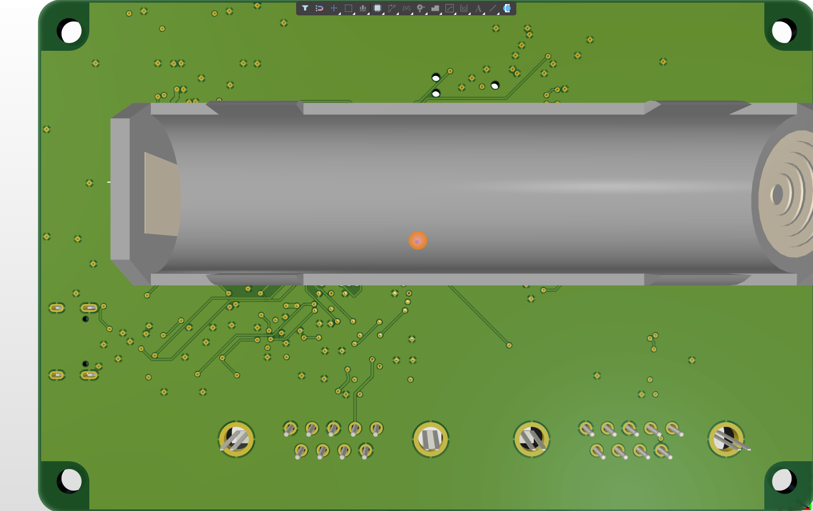

# CAN-FD Test Runner - Gate 3: Layout

| | |
|---|---|
| **Document** | PCB-002 |
| **Revision** | A |
| **Date** | 2026-09-30 |
| **Designer** | Muhamad Izzuwan Alif |
| **Against** | REQ-002 Rev A, ARCH-002 Rev A, SCH-002 Rev A |
| **Status** | Placed, routed, DRC clean (0 violations). Fabrication package outstanding |

> **Note on method.** Placement and a first routing pass were generated by scripts written with
> an AI assistant (`tools/place.py`, `tools/router.py`). The router left 15 connections open and
> 116 DRC violations; I finished the routing and the clean-up by hand in Altium.


## 1. Board

| Item | Value |
|---|---|
| Outline | **100 x 66 mm**, 3 mm corner radius (MR-01: fits 110 x 70 mm) |
| Mounting holes | MH1-MH4, 3.2 mm non-plated (M3), 4 mm in from each edge |
| Components | 131, all from `CAN_Test_Runner.PcbLib` |
| Nets | 89 |

The outline was fixed before an enclosure was chosen, so **MR-05 is still open**: the hole
positions must be checked against the enclosure drawing once one is picked.

## 2. Stack-up (MFR-01)

| Layer | Use |
|---|---|
| L1 Top | signals, components, GND pour |
| L2 Mid-Layer 1 | **solid GND plane**, a few short signal crossings |
| L3 Mid-Layer 2 | 3V3 pour, signals where needed |
| L4 Bottom | signals, BT1 18650 holder, GND pour |

1.6 mm FR-4, 1 oz copper. L2 sits directly under the top layer so every top-side signal has
an unbroken return path beneath it.

## 3. Design rules (D-03)

| Rule | Value | Why |
|---|---|---|
| Clearance | 0.127 mm (5 mil) | above the 4 mil process limit of MFR-02 |
| Clearance, pours | 0.25 mm | keeps poured copper visibly clear of fine-pitch pads |
| Width, signals | 0.102 min / 0.15 preferred | 4 mil minimum per MFR-02 |
| Width, CAN pairs | 0.15 min / 0.2 preferred | a little margin on the bus lines |
| Width, power nets | 0.3 min / 0.5 preferred | VBAT, VSYS, 3V3, 5V, charger and converter nodes |
| Via | 0.3 mm drill / 0.6 mm pad | ring 0.15 mm, meets MFR-03 |
| Hole size | max 3.5 mm | admits the 3.2 mm mounting holes |
| Solder-mask sliver | 0.075 mm | smallest sliver a standard fab holds |
| Silk to solder mask | **disabled, waived** | see section 6 |

## 4. Placement

- **Connectors on the edges they are used from:** both DB9s on the bottom edge (MR-08), USB-C
  and the microSD on the right edge (MR-03), buttons at the top-right corner (MR-04).
- **The 18650 holder BT1 is on the bottom side**, across the middle of the board, and locked in
  place. Its two 7.5 x 6.5 mm pads are keep-out zones for vias and bottom tracks of any other net.
- **Every decoupling capacitor is assigned to one supply pin** and placed next to it before
  anything else (ER-06). `tools/place.py` prints the pin-to-capacitor distance for each.
- `place.py` also checks the fixed parts against each other and against every hole. That check
  found 16 overlaps in the first draft, including mounting holes under connectors.

## 5. Routing

Order of work: power first (wide, short), then the USB pair, the SD bus, and the slow signals
last. The router did the first pass. Finishing by hand meant:

- **Shelving the pours** while routing, so the GND copper did not block every path, then
  restoring and repouring at the end.
- Keeping the SD lines on the top layer into the microSD pads, because CELL_P sits directly under
  that socket on the bottom.
- Fanning out in pin order at the microSD, so SD_CMD and SD_VDD never have to cross.
- Clearing net antennas (dead-end stubs), and solder-mask slivers where vias sat too close to
  U7 and U9 pads.

## 6. Design rule check (D-04)

Run on 2026-09-30 over the saved board. The report is committed at
`hardware/Project Outputs for CAN_Test_Runner/`.

```
Violations Detected : 0
Waived Violations   : 0
```

All enabled rules pass, including clearance, short-circuit, un-routed net (every net connected),
modified or shelved polygon, net antennae, hole-to-hole and solder-mask sliver.

**Waiver: silk to solder mask.** The rule is disabled. Component outlines follow the
manufacturers' land-pattern drawings and touch pad mask openings in places, and fabrication
houses clip silkscreen from mask openings as standard. No silk carries information that would
be lost by clipping.

## 7. 3D models (D-08)

Every part except the Tag-Connect footprint (pads only) carries a STEP body from the KiCad
`packages3D` library (CC-BY-SA 4.0 with the KiCad libraries exception), in
`hardware/3D_Models/`, placed by `tools/altium/bodies.pas`. Two are
stand-ins with the same outline, not the exact part:

| Part | Model used | Why |
|---|---|---|
| J6 JST PH SMD side entry | JST PH S3B-PH-K (through-hole, horizontal) | no SM4-TB model exists; the body overhangs the edge slightly in 3D only |
| J5 Wurth 10-pin 0.5 mm FPC | Hirose FH12-10S-0.5SH | no Wurth model available |



## 8. Still open

| ID | Item |
|---|---|
| MR-05 | Enclosure choice, and a hole-position check against its drawing |
| MFR-06 | Designators are hidden on the board for a clean silkscreen; board name, revision and designer still to add. Designators go on the assembly drawing (D-07) |
| MFR-07 | USB D+/D- as a 90 ohm differential pair: target documented here, impedance not yet calculated for this stack-up |
| D-05..D-07 | Gerbers and drill files, BOM, assembly drawing and pick-and-place |
