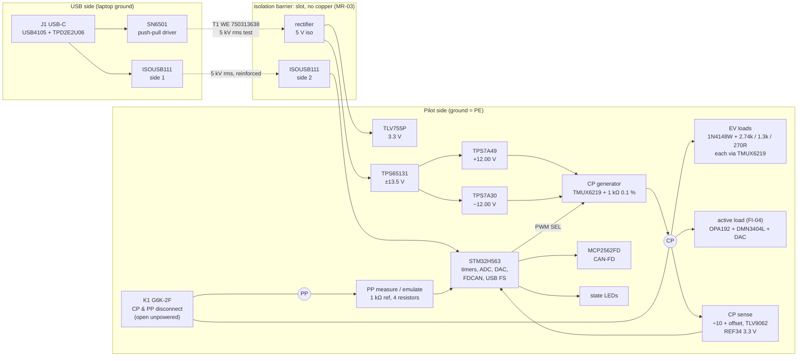

# EV Charge Pilot Tester - Gate 1: Architecture

| | |
|---|---|
| **Document** | ARCH-004 |
| **Revision** | A |
| **Date** | 2026-10-05 |
| **Author** | Muhamad Izzuwan Alif |
| **Answers** | REQ-004 Rev A, section 12, Gate 1 |
| **Status** | Draft, open for review |

> **Note on method.** As for REQ-004: worked out in discussion with an AI assistant. Every
> figure is derived here or quoted from a datasheet in `docs/datasheets/`, and the decisions
> are mine. Where a number is an **estimate** awaiting a datasheet table or a measurement, it
> says so.

---

## 1. Block diagram

Two domains, separated by one isolation barrier (ER-10). The **USB side** belongs to the laptop.
The **pilot side** belongs to the charging station or the vehicle: its ground *is* PE.



## 2. Part selection and justification

| Ref | Part | Why this part | Closes |
|---|---|---|---|
| **U1** | ST **STM32H563**, LQFP-64 variant | The microcontroller of board 02, so the datasheet, the toolchain and the firmware structure carry over. Hardware timers at 250 MHz give a **4 ns** duty-cycle resolution against a 1 ms period, 0.0004 %, far inside ER-05's 0.1 %. Has FDCAN (FR-11), USB full speed (FR-10), a 12-bit ADC that a timer can trigger mid-plateau (SR-01) and a DAC for the active load (FI-04). | FR-02, FR-06, FR-10, FR-11, ER-05, SR-01 |
| **U2** | TI **ISOUSB111** isolated USB repeater | Puts the barrier in the USB data path. Datasheet: **5000 V rms for 1 minute (UL 1577)** and **2121 V pk working, reinforced (VDE 0884-17)**, full speed 12 Mbit/s, 100 kV/µs CMTI. | ER-10, FR-10 |
| **U3 + T1** | TI **SN6501** + Würth **750313638** | Isolated power, reusing board 03's parts and board 03's reasoning (section 2.3 there): a transformer quotes a **working** isolation voltage, while a cheap DC-DC module usually quotes only a one-second test. T1 datasheet: turns ratio **1:1.3**, **reinforced insulation for 490 V rms working** (IEC 60664-1), **5000 V rms** insulation test, and Würth's own typical application is exactly 5 V in, 5 V out. SN6501 datasheet: **350 mA** maximum primary current at 5 V. | ER-10, Q-05 |
| **U4** | TI **TPS65131** | One chip makes both the positive and the negative rail from 5 V: input **2.7–5.5 V**, outputs adjustable **up to +15 V and down to −15 V**. Set to **±13.5 V**, which gives headroom for the linear regulators and for the switches below. | ER-02 |
| **U5, U6** | TI **TPS7A49** (+), **TPS7A30** (−) | Low-noise linear post-regulators to exactly ±12.00 V. They remove the switching ripple, which would otherwise appear directly on the CP plateau that ER-04 measures to ±0.1 V. Datasheets: TPS7A49 input **3–36 V**, 150 mA; TPS7A30 input **−3 to −35 V**, 200 mA; both about 15 µV rms noise. | ER-02, ER-04 |
| **U7–U15** | TI **TMUX6219** SPDT, nine off | ±4.5 to ±18 V supply, **2.1 Ω** on-resistance, an EN pin that turns both paths off, and TI lists **"AC charging (Pile) station"** as an application. One generates the CP square wave (SEL = PWM); eight switch the EV loads and the PP resistors (each used as a single switch through EN). | FR-02, FR-05, FR-07, FI-01, FI-02 |
| **K1** | Omron **G6K-2F**, 5 V coil | A normally-open, two-pole relay between the board and the CP and PP terminals. **Unpowered, or with the microcontroller not driving it, the outside world sees an open circuit, which is state A.** This is what makes ER-08 true by construction, not by firmware. Coil **21.1 mA at 5 V**, 3 ms operate and release. Driven by **Q1, DMN3404L**, with a gate pull-down and a 1N4148W flyback diode. | ER-08, SR-05 |
| **D1** | Diodes **1N4148W** | The vehicle's series diode in EV role. Datasheet: **0.715 V maximum at 1 mA**, which matches the 0.7 V assumed in REQ-004 section 1.1. | FR-05 |
| **U16** | TI **OPA192** | 36 V precision op-amp for the active load of FI-04 (section 6). Offset **±5 µV**, so the load setpoint error is set by the DAC, not by the amplifier. | FI-04, ER-04 |
| **U17** | TI **TLV9062** | Dual 3.3 V rail-to-rail op-amp buffering the divided CP and PP signals into the ADC. 10 MHz, so it settles well inside the shortest plateau (section 5). | ER-04, ER-06 |
| **U18** | TI **REF34** (3.3 V) | ADC reference and the source for the PP measurement. Datasheet: **±0.05 %** initial accuracy, **6 ppm/°C**. | ER-04, ER-06 |
| **U19** | Microchip **MCP2562FD** | CAN-FD transceiver of boards 01 and 02. | FR-11, ER-09 |
| **U20** | TI **TLV755P** | 3.3 V regulator on the isolated side, as on board 03. | ER-01 |
| **J1, D2** | GCT **USB4105**, TI **TPD2E2U06** | USB-C receptacle and ESD protection, both from board 03. | ER-01, ER-07 |
| **D3, D4** | Bourns **SMBJ15CA** | Bidirectional TVS on CP and PP, **15 V** stand-off, so a mistaken continuous ±15 V does not conduct (ER-07). | ER-07 |

### Parts deliberately not used

| Part | Why not |
|---|---|
| A bought isolated DC-DC module, for example "5 V to ±12 V, 1 W, 3 kV" | Same reason as board 03: the isolation figure is usually a one-second test, not a working voltage, and an unregulated module cannot meet ER-02's ±0.4 V. |
| TI **TMUX6111** quad switch (datasheet kept) | Four switches in one package would be cheaper, but its **120 Ω** on-resistance in series with the **270 Ω** state-D resistor would be a 44 % error. |
| TI **TPSI2140-Q1** isolated switch (datasheet kept) | It would satisfy ER-08 with no relay, but about nine would be needed, and at its price that alone breaks C-01. One relay (K1) gives the same guarantee for the whole board. |
| Analog Devices **ADuM4160**, **ADG5419**, **AD5292** and Toshiba / Panasonic photo-relays | Reasonable parts, but their datasheets could not be obtained for `docs/datasheets/`, and C-03 says no datasheet means no part. The TI parts above meet the same requirements. |

## 3. Isolation, closing Q-05

**Decision: reinforced isolation, rated by datasheet working voltage, not by a test pulse.**

REQ-004 asked for ≥ 1 kV and left open whether that is enough. The barrier is crossed by exactly two
parts, and both exceed any reasonable reading of it:

| Part | Test voltage | Working voltage |
|---|---|---|
| ISOUSB111 | 5000 V rms, 1 min | 2121 V pk, reinforced |
| WE 750313638 | 5000 V rms | 490 V rms, reinforced |

The limiting figure is **490 V rms working**, set by the transformer. In use, the potential difference
between a laptop and a charging station's PE is normally a few volts; the barrier exists for the
**fault** case, a station with a broken earth. Reinforced insulation at 490 V rms covers a 230 V
single-phase fault with margin, and **Q-05 is closed** on that basis. The PCB must match it:
creepage and clearance for reinforced 490 V rms are set as a design rule at Gate 3, and the slot of
MR-03 carries them.

**Ground choice, stated so nobody has to guess:** the pilot side's ground is PE. The CAN-FD interface
is on the pilot side too, so CAN ground equals PE. That is correct when the device sits on a vehicle's
bus, because the vehicle chassis is bonded to PE during charging anyway. It would be wrong on a bus whose
ground floats from PE; that case is out of scope and is written into the README as a limitation.

## 4. ±12 V generation and the CP output (ER-02, ER-03)

```
 5 V iso ─► TPS65131 ─► +13.5 V ─► TPS7A49 ─► +12.00 V ─┐
                     └► −13.5 V ─► TPS7A30 ─► −12.00 V ─┤
                                                         ├─► TMUX6219 (S1/S2, SEL = timer PWM) ─► 1 kΩ 0.1 % ─► CP
```

**Level accuracy (ER-02, ±0.4 V).** The rails set the plateaus. The feedback dividers use 0.1 %
resistors; the regulators' own feedback reference tolerance is the larger term and must be taken from
the TPS7A49 and TPS7A30 electrical-characteristics tables at Gate 2 (**estimate: ±1.5 %, which is
±0.18 V**). The switch adds its on-resistance in series with the 1 kΩ source: in the worst case, state D,
12 V × 2.1 Ω / (1 kΩ + 246 Ω + 2.1 Ω) = **20 mV**. Total, estimated: **±0.2 V against ±0.4 V allowed.**
If the regulator tolerance turns out wider, one trim point in firmware (the generator is measured by the
board's own sense chain during self-test, FR-13) corrects it.

**Edges (ER-03, < 10 µs).** The switch itself turns over in nanoseconds. What remains is the source
resistor charging the line capacitance: 10 m of cable at an assumed 100 pF/m gives 1 nF, and
1 kΩ × 1 nF = **1 µs** time constant, so the edge is complete (5 τ) in about **5 µs**. Inside the limit
even with a long cable.

**Duty cycle (FR-02, 0.1 % steps).** From a 250 MHz timer clock, one 1 kHz period is 250 000 counts.
0.1 % is 250 counts, and the finest step is one count, 0.0004 %.

## 5. Measurement chain (ER-04, ER-05, ER-06, SR-01)

**CP voltage.** The CP line (±13 V range) is scaled by **k = 0.1** and offset to the middle of the ADC range:

V_ADC = 1.65 V + 0.1 × V_CP, so −13 V → 0.35 V and +13 V → 2.95 V, inside 0 to 3.3 V with margin.

The divider and offset network uses 0.1 % resistors and is referenced to the REF34; a TLV9062 buffers
it into the ADC. One ADC count at the CP line is 3.3 V / 4096 / 0.1 = **8.1 mV**.

| Error term, referred to CP | Size | Source |
|---|---|---|
| Divider ratio, 0.1 % resistors, worst case at 13 V | 26 mV | derived |
| Reference, ±0.05 % | 7 mV | REF34 datasheet |
| ADC, assumed ±2 LSB INL and ±3 LSB offset | 40 mV | **estimate**, to be confirmed against the H563 ADC table at Gate 2 |
| Buffer offset, ±0.3 mV / 0.1 | 3 mV | TLV9062 datasheet |
| **Root sum square** | **≈ 49 mV** | against **±100 mV** required |

The ADC offset dominates, and it is the term a one-point calibration removes, so the margin grows
after FR-13's self-test.

**Sampling on the plateau (SR-01).** The timer that generates or captures the PWM also triggers the ADC:
once in the middle of the high plateau and once in the middle of the low plateau. The shortest plateau
that must be measured is the 5 % duty cycle (high-level communication request), **50 µs**. With the
1 µs line time constant of section 4, the signal has settled long before mid-plateau at 25 µs.

**Duty cycle and frequency, EV role (FR-06, ER-05).** The divided CP signal is compared against the
1.65 V midpoint, and the comparator output goes to a timer input capture at 250 MHz: resolution
**4 ns**, 0.0004 % of a period. The comparator part is chosen at Gate 2 (Q-08).

**PP resistance (FR-04, ER-06).** In EVSE role the PP line is pulled up through **1 kΩ 0.1 %** from the
REF34, and the ADC reads the divider: V = 3.3 V × R_PP / (1 kΩ + R_PP). The reading is ratiometric to
the same reference that feeds the ADC, so the reference's own tolerance cancels. Over the four cable
codes (100 Ω to 1.5 kΩ) the divider spans 0.30 V to 1.98 V, and the ±3 % cable tolerance bands remain
separate with the 0.1 % reference resistor.

## 6. Fault injection hardware (section 3 of REQ-004)

| Fault | How |
|---|---|
| FI-01 diode missing | A TMUX6219 shorts D1 |
| FI-02 CP shorted to PE | A TMUX6219 from CP to PE, 2.1 Ω |
| FI-03 CP open | K1 opens |
| **FI-04 level at a band edge** | **Active load**, below |
| FI-05 to FI-07 duty cycle and frequency | Firmware: the generator timer |
| FI-08 PP invalid or changing | PP resistor switches, including all off |
| FI-09 abrupt C to A | The state C and B load switches open together |

**The active load (FI-04).** Fixed resistors cannot place a level "just inside" and "just outside" every
band edge without a resistor for each, which would mean twelve more switches. Instead a programmable
current sink sits behind D1: the DAC sets a target, the OPA192 drives the DMN3404L so the sink current
follows it, and the firmware closes the loop on the **measured** high level until it sits where the test
asked, within one measurement step. It only ever sinks current on the positive half, because D1 blocks
the negative half, exactly like a real vehicle. Its resolution is the DAC's, not a resistor ladder's, so
any level from 0 V to 12 V is reachable, not just a predefined few.

## 7. Power budget (ER-01, SN6501 limit)

Isolated 5 V rail, after the transformer:

| Load | Current at 5 V iso | Basis |
|---|---|---|
| 3.3 V logic through TLV755P: MCU at a reduced 100 MHz clock, ISOUSB111 side 2, LEDs, op-amps, reference | 90 mA | **estimate**; MCU current to be taken from the H563 datasheet table at Gate 2 |
| MCP2562FD, average at 10 Hz plus traffic | 30 mA | **estimate**; dominant current is short and buffered by local capacitance |
| K1 relay coil | 21 mA | G6K datasheet, 21.1 mA |
| TPS65131 input for ±12 V loads of ≤ 14 mA each (state E short plus op-amps), at about 80 % efficiency | 95 mA | derived: 2 × 13.5 V × 14 mA / 0.8 / 5 V = 94.5 mA |
| **Total** | **≈ 236 mA, 1.18 W** | |

Through the SN6501 and transformer at an assumed 85 % efficiency, the primary draws about
1.18 W / 0.85 / 5 V = **278 mA**, against the SN6501's **350 mA** maximum: **21 % margin**.
From USB, adding the USB-side half of the ISOUSB111, the total is about **295 mA against ER-01's
500 mA**.

The margin is real but not large, and two of the four lines are estimates. **Fallback, if the Gate 2
figures eat the margin:** the SN6505, the 1 A member of the same family, with the same transformer. Its
datasheet is fetched only if needed.

## 8. Cost check (C-01, 80 EUR)

**Estimate**, single quantity, to be replaced by distributor prices and stock figures at Gate 2 (MFR-03):

| Group | EUR |
|---|---|
| STM32H563 | 7 |
| ISOUSB111, SN6501, transformer | 9 |
| TPS65131, TPS7A49, TPS7A30 | 9 |
| TMUX6219 × 9 | 16 |
| OPA192, TLV9062, REF34 | 5 |
| G6K relay, MCP2562FD, USB-C, TVS and ESD | 7 |
| 3 × 4 mm safety sockets | 6 |
| Passives, 0.1 % resistors, LEDs | 6 |
| PCB, two layers, five off | 8 |
| **Total** | **≈ 73** |

Inside 80 EUR, but with little room. The nine switches are the largest line, and the first place to look
if Gate 2 prices come in high.

## 9. Requirement traceability at architecture level

| Requirement | Met by |
|---|---|
| FR-01, FR-12 | U1, state LEDs |
| FR-02, ER-02, ER-03 | U4–U7, 1 kΩ source, section 4 |
| FR-03, FR-06, ER-04, ER-05, SR-01 | Sense chain U17/U18, timer-triggered ADC, input capture, section 5 |
| FR-04, FR-07, ER-06 | PP network, section 5 |
| FR-05, FI-01, FI-02, FI-09 | D1 and TMUX6219 load switches |
| FI-03 | K1 |
| FI-04 | Active load, section 6 |
| FR-10 | U1 USB through U2 |
| FR-11, ER-09 | U19 |
| ER-07 | D3, D4, D2 |
| ER-08, SR-05 | K1 with gate pull-down; switch EN pins pulled to off |
| ER-10, MR-03 | U2, T1, section 3 |
| ER-11 | Firmware interlock, Gate 4 |
| FR-08, FR-09, FR-13, SR-02 to SR-07 | Firmware, Gate 4 |

## 10. Open questions, and the decision taken on each

| ID | Status | Decision or next step |
|---|---|---|
| Q-01 32 A resistor, 200 or 220 Ω | **Open** | Needs IEC 61851-1. Does not block the schematic: the footprint is the same either way |
| Q-02 access to IEC 61851-1 | **Open** | Ask the THI library before Gate 2 |
| Q-03 vehicle reaction time | Open | Only sets a firmware pass/fail limit; Gate 4 |
| Q-04 breakout adapter | Open | Fixes nothing on the board, because MR-02's sockets are standard 4 mm |
| **Q-05 isolation level** | **Closed** | Reinforced, 490 V rms working, section 3 |
| Q-06 CP frequency tolerance | Open | Firmware limit; Gate 4 |
| **Q-07 (new)** | Open | Regulator reference tolerance and H563 ADC figures, to confirm the estimates in sections 4 and 5 |
| **Q-08 (new)** | Open | Comparator part for the duty-cycle capture of section 5 |
| **Q-09 (new)** | Open | The exact LQFP-64 H563 part number and its pin map, checked in STM32CubeMX against the peripheral list above, as was done for board 02 |
