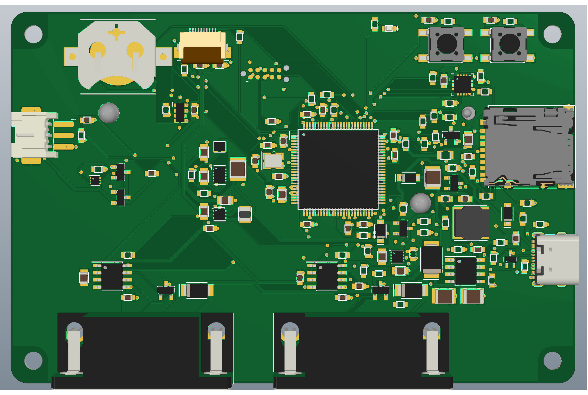
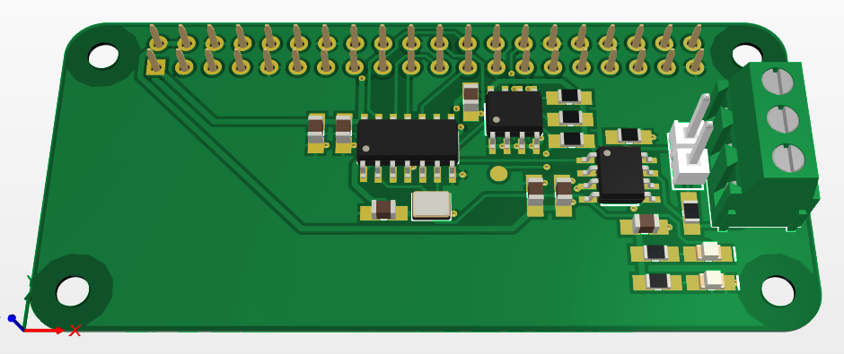
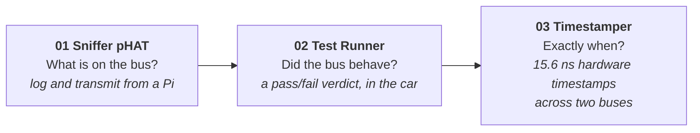
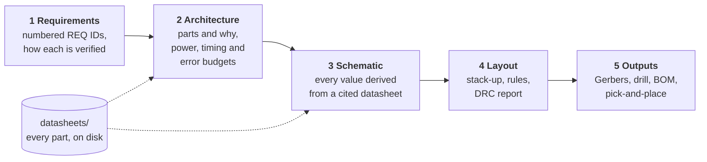

<h1 align="center">Automotive PCB portfolio</h1>

<p align="center">
  <b>Three CAN-FD tools for vehicle networks, designed end to end in Altium Designer:<br>
  requirements, architecture, schematic, layout and a manufacturing package, with every decision written down.</b>
</p>

<p align="center">
  
  
  
  
  
</p>

<table>
<tr>
<td width="62%"></td>
<td width="38%"><br><br>
<sub><b>Left:</b> 02, the CAN-FD Test Runner. Four layers, 100 x 66 mm, STM32H563, two CAN-FD channels on DB9, battery-backed.<br><br>
<b>Above:</b> 01, the CAN-FD Sniffer pHAT for the Raspberry Pi Zero 2 W. Two layers, 65 x 30 mm.</sub></td>
</tr>
</table>

---

## Three boards, one question: what is really happening on the bus?

Each board answers a question the one before it cannot.



| | [01 CAN-FD Sniffer pHAT](01-CAN-Sniffer-HAT/) | [02 CAN-FD Test Runner](02-CAN-Test-Runner/) | [03 CAN-FD Hardware Timestamper](03-CAN-Timestamper/) |
|---|---|---|---|
| **What it is** | A HAT that gives a Pi Zero 2 W one CAN-FD channel; comes up with the mainline Linux driver | A handheld that runs a test you wrote, for a whole drive, and ends with **PASSED / FAILED / INCOMPLETE** | A two-channel isolated capture board that decodes CAN-FD **inside an FPGA** and timestamps each frame at its first edge |
| **Board** | 2 layers · 65 x 30 mm | 4 layers · 100 x 66 mm | 4 layers · 100 x 80 mm |
| **Key parts** | MCP2518FD, MCP2562FD, 40 MHz crystal, HAT ID EEPROM | STM32H563 (640 KB SRAM), 2x MCP2562FD, LiFePO4 charger BQ25170, fuel gauge PAC1941, Sharp memory LCD, RTC | Lattice ECP5-25F (TQFP144), 2x ISO1042 isolated transceivers, SN6501 isolated supplies, FT2232H USB |
| **Hard part** | No 5 V may reach a Pi GPIO: logic level set in silicon by the transceiver's VIO pin | The SD card stalls up to 250 ms: that number sized the RAM buffer and picked the MCU | A separate isolation barrier per channel, built into placement and routing as hard keep-outs |
| **State** | Routed · **DRC clean** | Routing finished by hand · **DRC clean** · Gerbers, drill, BOM, pick-and-place | Schematic done · routed · **DRC not yet clean** |

---

## How each board is designed

Every project goes through the same gates, and nothing moves on until the current gate holds together.
Questions raised against the specification are written down with the decision taken on each.



**What that looks like in practice:**

- **Footprints and symbols are drawn from the manufacturer's drawings,** not pulled from a vendor library, and the
  datasheet each one came from is committed next to the design.
- **Requirements are traceable.** Each document says which requirement IDs it closes, and each project README
  lists what is still open.
- **The design is checked by code as well as by eye.** Projects 02 and 03 generate their netlist from one
  Python description (`tools/design.py`) with a checker that refuses, for example, a net crossing the isolation
  barrier on board 03.
- **Numbers are derived, not guessed.** Buffer sizes, power budgets, timing and the timestamp error budget are
  worked out in the architecture documents, with the reasoning shown.

<details>
<summary><b>Folder layout of each project</b></summary>

```
NN-project-name/
  README.md      what it does, the decisions and why, traceability, limitations
  docs/          01-requirements, 02-architecture, 03-schematic, 04-layout
    datasheets/  every datasheet cited in those documents
  hardware/      the Altium project: schematic, PCB, libraries, output jobs and reports
  tools/         the scripts the design is generated or checked with
  images/        3D views and schematic sheets
```

Project 03's logic is a design in its own right: the VHDL receiver is developed and verified in a separate
repository, [fpga-can-timestamper](https://github.com/Alifizz01/fpga-can-timestamper) (simulated, synthesised,
timing-closed in CI), and treated here as a fixed input with a known pin map, clock and I/O standard.
</details>

---

## Honest status

I would rather be clear about how far a design has gone than dress it up.

| | Schematic | Layout | DRC | Fab outputs | Built and measured |
|---|:---:|:---:|:---:|:---:|:---:|
| 01 Sniffer pHAT | ✅ | ✅ | ✅ 0 violations | ⬜ | ⬜ |
| 02 Test Runner | ✅ | ✅ | ✅ 0 violations | ✅ | ⬜ |
| 03 Timestamper | ✅ | ✅ routed | 🔶 391 open items | ⬜ | ⬜ |

"DRC clean" means the design rule check passes, nothing more. These are portfolio designs and have not been
fabricated, so nothing here has been proven against real copper yet. Where requirements and architecture were
worked out in discussion with an AI assistant, the project README says so; every figure is either derived in the
documents or taken from a cited datasheet, and the design decisions are mine.

## License

MIT, see [LICENSE](LICENSE). Datasheets in `docs/datasheets/` remain the property of their manufacturers.
